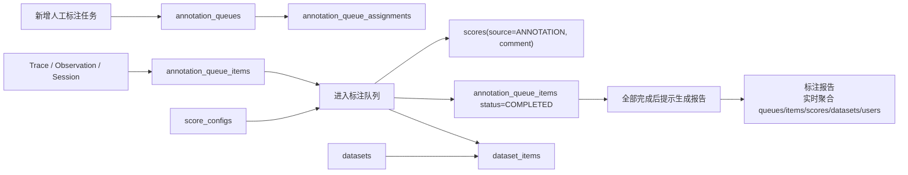

# 人工标注模块需求描述

日期：2026-07-03

## 1. 背景与目标

人工标注模块用于将项目中的 trace、observation 或 session 放入人工标注队列，由处理人按项目配置的评分指标完成人工评分、备注和数据沉淀。模块设计严格参考 Langfuse 社区版 Annotation Queues、Scores、Score Configs 与 Datasets 的数据结构和 API 能力，优先复用 Langfuse 原生表与接口，避免重复建设标注队列、评分和数据集能力。

本期目标：

- 新增人工标注任务。
- 查询人工任务列表，列表字段与 Langfuse Annotation Queues 保持一致。
- 为人工任务配置处理人。
- 进入人工任务的标注队列，查看待处理和已完成的标注数据。
- 对单条标注数据进行人工评分，并支持评分备注。
- 将标注数据加入指定数据集。
- 删除选中的标注队列数据。
- 标注评分指标从项目设置中的 Langfuse Score Configs 加载。
- 当任务内全部队列数据完成标注后，提示用户是否生成标注报告。

本期明确不做审核流：不设置审核人，不提供审核通过、审核驳回、返工、审核记录等动作。

## 2. 设计原则

- Langfuse 兼容优先：人工任务复用 `annotation_queues`，队列数据复用 `annotation_queue_items`，处理人分配复用 `annotation_queue_assignments`。
- 评分机制复用：人工标注结果写入 Langfuse `scores`，评分指标从 `score_configs` 读取。
- 数据集沉淀复用：加入数据集复用 `datasets` 与 `dataset_items`。
- 不改 Langfuse 原生表结构：禁止修改 Langfuse 既有表结构；确需扩展时才新增 `pa_` 前缀扩展表。
- 本期不新增 PA 扩展表：去掉审核流后，原生 Annotation Queue 已能覆盖任务、队列、处理人、完成状态与评分。
- 删除语义清晰：删除标注队列数据仅移除 `annotation_queue_items`，不删除源 trace、observation、session，也不删除已产生的 scores。
- 报告按需生成：标注报告优先基于 Langfuse 原生数据实时聚合生成，不单独修改 Langfuse 原生表结构；如后续需要保存报告快照，再新增 `pa_` 前缀扩展表或对象存储记录。

## 3. 范围说明

### 3.1 本期范围

| 功能域 | 功能点 | 说明 |
| --- | --- | --- |
| 人工任务 | 新增人工标注任务 | 创建 Langfuse annotation queue |
| 人工任务 | 查询任务列表 | 参考 Langfuse Annotation Queues 列表字段 |
| 处理人 | 配置处理人 | 复用 annotation queue assignments |
| 标注队列 | 查询队列数据 | 查看 PENDING、COMPLETED 数据 |
| 标注队列 | 进入单条数据 | 展示源 trace、observation 或 session 上下文 |
| 人工标注 | 评分 | 按项目 score configs 生成评分输入 |
| 人工标注 | 备注 | 写入 score comment |
| 数据沉淀 | 加入指定数据集 | 创建 dataset item |
| 队列维护 | 删除选中标注数据 | 删除 annotation queue item |
| 标注报告 | 完成后提示生成报告 | 所有队列数据完成后提示用户生成标注报告 |
| 标注报告 | 查看和导出报告 | 基于队列、评分、备注、数据集沉淀情况生成报告 |

### 3.2 非本期范围

- 审核人配置。
- 审核通过、审核驳回、返工。
- 多级审核流。
- 标注任务 SLA、质检抽检、绩效统计。
- 标注报告长期版本管理和在线批注。
- 修改 Langfuse 原生表结构。
- 直接删除 trace、observation、session。
- 删除队列数据时级联删除 scores。

## 4. Langfuse 数据模型复用

### 4.1 annotation_queues

`annotation_queues` 对应人工标注任务。

| 字段 | 说明 |
| --- | --- |
| `id` | 任务 ID |
| `project_id` | 项目 ID |
| `name` | 任务名称，项目内唯一 |
| `description` | 任务描述 |
| `score_config_ids` | 本任务使用的评分指标 ID 列表 |
| `created_at` | 创建时间 |
| `updated_at` | 更新时间 |

任务列表展示字段与 Langfuse 保持一致：

| 展示字段 | 数据来源 |
| --- | --- |
| Name | `annotation_queues.name` |
| Description | `annotation_queues.description` |
| Completed Items | `annotation_queue_items.status = COMPLETED` 聚合 |
| Pending Items | `annotation_queue_items.status = PENDING` 聚合 |
| Score Configs | `annotation_queues.score_config_ids` 关联 `score_configs` |
| Created | `annotation_queues.created_at` |
| Process | 进入队列处理页 |
| Actions | 编辑、删除等动作 |

### 4.2 annotation_queue_items

`annotation_queue_items` 对应标注队列中的单条待处理数据。

| 字段 | 说明 |
| --- | --- |
| `id` | 队列数据 ID |
| `queue_id` | 所属人工任务 ID |
| `object_id` | 源对象 ID |
| `object_type` | 源对象类型，`TRACE`、`OBSERVATION`、`SESSION` |
| `status` | 队列状态，`PENDING` 或 `COMPLETED` |
| `locked_at` | 锁定时间，沿用 Langfuse 处理占用机制 |
| `locked_by_user_id` | 锁定人 |
| `annotator_user_id` | 完成人，即实际处理人 |
| `completed_at` | 完成时间 |
| `project_id` | 项目 ID |
| `created_at` | 创建时间 |
| `updated_at` | 更新时间 |

队列列表展示字段与 Langfuse 保持一致：

| 展示字段 | 数据来源 |
| --- | --- |
| Id | `annotation_queue_items.id` |
| Type | `annotation_queue_items.object_type` |
| Source | 根据 `object_type` 链接到 trace、observation 或 session |
| Source ID | `annotation_queue_items.object_id` |
| Status | `annotation_queue_items.status` |
| Completed At | `annotation_queue_items.completed_at` |
| Completed by | `annotation_queue_items.annotator_user_id` 关联用户 |

### 4.3 annotation_queue_assignments

`annotation_queue_assignments` 对应人工任务处理人配置。

| 字段 | 说明 |
| --- | --- |
| `id` | 分配记录 ID |
| `project_id` | 项目 ID |
| `queue_id` | 人工任务 ID |
| `user_id` | 处理人用户 ID |
| `created_at` | 创建时间 |
| `updated_at` | 更新时间 |

处理人规则：

- 一个任务可以配置多个处理人。
- 一个用户在同一任务中只能有一条 assignment。
- 只有具备项目标注队列管理权限的用户可以新增或删除处理人。
- 删除处理人只删除 assignment，不影响该用户历史完成的标注记录。

### 4.4 score_configs

`score_configs` 是项目设置中的评分指标配置，人工标注页面必须从这里加载指标。

| 字段 | 说明 |
| --- | --- |
| `id` | 指标 ID |
| `project_id` | 项目 ID |
| `name` | 指标名称 |
| `data_type` | 指标类型，`NUMERIC`、`CATEGORICAL`、`BOOLEAN`、`TEXT` |
| `min_value` | 数值型最小值 |
| `max_value` | 数值型最大值 |
| `categories` | 分类型可选项 |
| `description` | 指标说明 |
| `is_archived` | 是否归档 |
| `created_at` | 创建时间 |
| `updated_at` | 更新时间 |

加载规则：

- 新增人工任务时，用户从当前项目未归档的 score configs 中选择一个或多个指标。
- 进入标注页面时，按 `annotation_queues.score_config_ids` 加载指标。
- 如果某个指标已归档但历史 scores 存在，页面仍可展示历史值，但不允许新增空白评分项。
- 指标类型渲染方式参考 Langfuse AnnotationForm：
  - `NUMERIC`：数值输入，受 `min_value`、`max_value` 约束。
  - `CATEGORICAL`：单选分类，选项来自 `categories`。
  - `BOOLEAN`：布尔选择。
  - `TEXT`：文本输入。

### 4.5 scores

人工标注结果复用 Langfuse `scores`。

| 字段 | 说明 |
| --- | --- |
| `id` | 评分 ID |
| `project_id` | 项目 ID |
| `trace_id` | trace ID，按标注对象关联 |
| `observation_id` | observation ID，标注 observation 时写入 |
| `name` | 指标名称 |
| `config_id` | score config ID |
| `data_type` | 指标类型 |
| `value` | 数值或布尔值 |
| `string_value` | 文本或分类值 |
| `comment` | 人工标注备注 |
| `source` | 固定为 `ANNOTATION` |
| `author_user_id` | 标注人用户 ID |
| `created_at` | 创建时间 |
| `updated_at` | 更新时间 |

备注规则：

- 标注备注写入 `scores.comment`。
- 每个指标可独立填写备注。
- 备注为空时不影响评分提交。
- 更新评分时可同步更新备注。

### 4.6 datasets 与 dataset_items

标注数据加入指定数据集时，复用 Langfuse 数据集结构。

| 模型 | 用途 |
| --- | --- |
| `datasets` | 目标数据集 |
| `dataset_items` | 加入数据集后的单条数据 |

加入数据集规则：

- 用户从当前项目已有数据集中选择目标数据集。
- 系统根据标注对象读取 source trace、observation 或 session 的输入输出上下文。
- 创建 `dataset_items`，写入 `input`、`expected_output`、`metadata`、`source_trace_id`、`source_observation_id`。
- `dataset_items.metadata` 建议写入来源信息：

```json
{
  "source": "manual_annotation",
  "annotationQueueId": "queue_xxx",
  "annotationQueueItemId": "item_xxx",
  "annotatorUserId": "user_xxx",
  "scoreIds": ["score_xxx"]
}
```

## 5. 功能需求

### 5.1 新增人工标注任务

入口：

- 人工标注模块列表页点击“新增人工标注任务”。

字段：

| 字段 | 必填 | 说明 |
| --- | --- | --- |
| 任务名称 | 是 | 对应 `annotation_queues.name`，项目内唯一 |
| 任务描述 | 否 | 对应 `annotation_queues.description` |
| 评分指标 | 是 | 选择一个或多个 `score_configs.id` |
| 处理人 | 否 | 创建后写入 `annotation_queue_assignments` |

保存逻辑：

1. 校验任务名称非空且项目内唯一。
2. 校验评分指标存在、属于当前项目，且未归档。
3. 创建 `annotation_queues`。
4. 如选择处理人，创建 `annotation_queue_assignments`。
5. 返回任务详情。

### 5.2 查询人工任务列表

列表字段与 Langfuse Annotation Queues 保持一致。

| 字段 | 说明 |
| --- | --- |
| Name | 任务名称 |
| Description | 任务描述 |
| Completed Items | 已完成数据量 |
| Pending Items | 待处理数据量 |
| Score Configs | 评分指标名称和类型 |
| Created | 创建时间 |
| Process | 进入标注队列 |
| Actions | 编辑、删除 |

查询能力：

- 分页参数使用 `page` 和 `pageSize`。
- 支持按任务名称模糊查询，PA Plus 层可在 Langfuse 原生列表查询基础上补充过滤。
- 支持按处理人筛选作为增强能力。
- 支持按是否包含待处理数据筛选作为增强能力。

### 5.3 配置处理人

处理人配置用于控制哪些项目用户可处理该任务。

操作：

- 添加处理人。
- 移除处理人。
- 查看当前处理人列表。

规则：

- 处理人必须是当前项目可访问用户。
- 添加处理人复用 Langfuse Assignment API。
- 移除处理人仅删除 assignment，不删除队列数据和历史 scores。
- 如果未配置处理人，具备项目标注权限的用户仍可进入队列；是否强制限制为处理人可作为权限增强项。

### 5.4 标注队列列表

进入任务后展示队列数据。

字段：

| 字段 | 说明 |
| --- | --- |
| Id | 队列数据 ID |
| Type | TRACE、OBSERVATION、SESSION |
| Source | 跳转源对象 |
| Source ID | 源对象 ID |
| Status | PENDING、COMPLETED |
| Completed At | 完成时间 |
| Completed by | 完成人 |

操作：

- 进入单条标注。
- 批量选择。
- 删除选中数据。

状态规则：

- 新加入队列的数据默认 `PENDING`。
- 完成评分后将状态更新为 `COMPLETED`。
- 重新编辑已完成数据的评分，不改变 `COMPLETED` 状态。

### 5.5 标注单条数据

进入单条数据后展示：

- 源对象基础信息。
- trace、observation 或 session 的上下文。
- 本任务配置的评分指标。
- 已保存的人工评分和备注。
- 加入数据集操作。

评分提交规则：

1. 页面按 `annotation_queues.score_config_ids` 加载 score configs。
2. 用户按指标填写评分值。
3. 用户可为每个指标填写备注。
4. 保存时创建或更新 `scores`，`source` 固定为 `ANNOTATION`。
5. 保存成功后更新 `annotation_queue_items.status = COMPLETED`，写入 `completed_at` 和 `annotator_user_id`。

校验规则：

| 指标类型 | 校验 |
| --- | --- |
| NUMERIC | 必须是数字；如配置 min/max，需要落在范围内 |
| CATEGORICAL | 必须来自 categories |
| BOOLEAN | 必须是布尔值 |
| TEXT | 可为空或文本，长度限制由前后端统一约束 |

### 5.6 将标注数据加入指定数据集

入口：

- 单条标注数据详情页点击“加入数据集”。

字段：

| 字段 | 必填 | 说明 |
| --- | --- | --- |
| 目标数据集 | 是 | 当前项目下已有 dataset |
| input | 是 | 默认从源对象上下文提取，可编辑 |
| expected_output | 否 | 默认从源对象输出或人工标注结果提取，可编辑 |
| metadata | 否 | 默认带入标注来源信息 |

保存逻辑：

1. 校验目标数据集属于当前项目。
2. 根据源对象生成 dataset item。
3. 写入 source trace/observation 信息。
4. 写入标注来源 metadata。
5. 创建 `dataset_items`。

重复加入规则：

- 如果同一 `annotationQueueItemId` 已加入同一数据集，前端提示用户确认是否继续。
- 默认允许创建新版本或新数据项，具体实现应遵循 Langfuse dataset item upsert/版本机制。

### 5.7 删除选中标注数据

删除范围：

- 仅删除 `annotation_queue_items`。
- 不删除源 trace、observation、session。
- 不删除已存在的 scores。
- 不删除已加入数据集的 dataset items。

交互规则：

- 支持批量选择。
- 删除前弹出确认提示。
- 删除成功后刷新队列列表。
- 若部分数据删除失败，返回失败明细。

### 5.8 标注完成后生成标注报告

触发条件：

- 当某个人工标注任务下 `annotation_queue_items.status = PENDING` 的数量变为 0，且队列总数据量大于 0 时，系统提示用户是否生成标注报告。
- 触发点包括单条标注保存成功、批量导入评分状态刷新、重新进入已完成任务详情页。
- 如果任务后续又新增待标注数据，任务恢复为未完成状态；再次全部完成后可重新提示生成报告。

交互规则：

- 提示文案建议为“当前任务已全部标注完成，是否生成标注报告？”。
- 用户可选择“立即生成”或“稍后再说”。
- “稍后再说”仅关闭本次提示，不影响任务列表中的“生成报告”入口。
- 已完成任务列表和任务详情页应提供“生成报告”或“查看报告”操作。
- 报告生成失败时不影响已完成标注状态。

报告生成方式：

- 本期优先实时聚合生成，不新增报告存储表。
- 报告内容来自 `annotation_queues`、`annotation_queue_items`、`annotation_queue_assignments`、`score_configs`、`scores`、`datasets`、`dataset_items` 和用户表。
- 可导出为 Markdown、HTML 或 PDF；第一版建议至少支持页面查看和 Markdown 下载。
- 如需保存历史快照，后续新增 `pa_annotation_reports`，字段至少包含 `project_id`、`queue_id`、`report_type`、`content`、`generated_by`、`generated_at`，并通过 Alembic 支持回滚。

报告内容：

| 模块 | 内容 | 数据来源 |
| --- | --- | --- |
| 报告摘要 | 任务名称、任务描述、项目、生成时间、生成人、标注时间范围 | `annotation_queues`、`annotation_queue_items` |
| 完成情况 | 总数据量、已完成量、待处理量、完成率、首次/最后完成时间 | `annotation_queue_items` |
| 标注对象构成 | TRACE、OBSERVATION、SESSION 数量和占比 | `annotation_queue_items.object_type` |
| 评分指标概览 | 使用的 score configs、指标类型、数值范围、分类选项 | `score_configs` |
| 评分分布 | numeric 的均值/中位数/最小值/最大值/分位数，categorical/boolean/text 的分布统计 | `scores` |
| 标注人产出 | 每个处理人的完成数量、占比、最近完成时间 | `annotation_queue_items.annotator_user_id` |
| 备注分析 | 有备注数量、备注覆盖率、典型备注样例、低分备注样例 | `scores.comment` |
| 低分或异常样本 | 按 numeric 低分、boolean false、指定分类值等规则列出样本 | `scores`、源对象 ID |
| 数据集沉淀 | 加入数据集数量、目标数据集列表、未加入数据集数量 | `dataset_items.metadata` 或 source trace/observation |
| 质量提示 | 缺失评分、无备注低分样本、评分越界、重复加入数据集等风险 | 聚合校验结果 |
| 一致性指标 | 存在多人重复标注时展示一致性指标；单人单样本标注时说明不适用 | `scores` 聚合 |
| 后续建议 | 需要复查的样本、建议沉淀的数据集、评分指标优化建议 | 聚合规则生成 |

一致性指标规则：

- 当同一队列数据被两个标注人以上重复标注，且同一 score config 存在多份人工评分时，可计算标注一致性。
- 分类或布尔指标优先展示一致率、Cohen's kappa 或 Fleiss' kappa。
- 多标注人、多类型或存在缺失值时，可展示 Krippendorff's alpha。
- 数值指标可展示均值差、标准差、极差和组内相关系数等统计。
- 本期没有重复标注机制时，报告中展示“不适用：当前任务未配置重复标注”。

行业实践参考：

- 数据集文档实践强调记录数据来源、采集/标注过程、组成、推荐用途和限制，可参考 Datasheets for Datasets 与 Data Cards 的结构。
- 标注质量实践通常关注标注覆盖率、标签或评分分布、标注人产出、异常样本、备注信息与一致性指标。
- 标注一致性可参考 inter-rater reliability 相关指标；Cohen's kappa 用于两名标注人的分类一致性，Krippendorff's alpha 可扩展到多标注人、多类型数据和缺失值场景。

## 6. API 设计

Plus 层对前端提供统一 RESTful API，响应格式遵循项目规范：

```json
{
  "code": 0,
  "message": "success",
  "data": {},
  "txId": "trace-id"
}
```

### 6.1 人工任务 API

| 方法 | 路径 | 说明 | Langfuse 复用 |
| --- | --- | --- | --- |
| GET | `/projects/{projectId}/annotation-queues` | 查询人工任务列表 | GET `/api/public/annotation-queues` 或查询 `annotation_queues` |
| POST | `/projects/{projectId}/annotation-queues` | 新增人工任务 | POST `/api/public/annotation-queues` |
| GET | `/projects/{projectId}/annotation-queues/{queueId}` | 查询任务详情 | GET `/api/public/annotation-queues/{queueId}` |
| PATCH | `/projects/{projectId}/annotation-queues/{queueId}` | 编辑任务基础信息 | Langfuse tRPC/自建接口，需保持原生表字段 |
| DELETE | `/projects/{projectId}/annotation-queues/{queueId}` | 删除任务 | Langfuse tRPC/自建接口 |

分页列表 `data` 格式：

```json
{
  "total": 0,
  "datas": []
}
```

### 6.2 处理人 API

| 方法 | 路径 | 说明 | Langfuse 复用 |
| --- | --- | --- | --- |
| GET | `/projects/{projectId}/annotation-queues/{queueId}/assignments` | 查询处理人 | 查询 `annotation_queue_assignments` |
| POST | `/projects/{projectId}/annotation-queues/{queueId}/assignments` | 添加处理人 | POST `/api/public/annotation-queues/{queueId}/assignments` |
| DELETE | `/projects/{projectId}/annotation-queues/{queueId}/assignments/{userId}` | 移除处理人 | DELETE `/api/public/annotation-queues/{queueId}/assignments` |

### 6.3 队列数据 API

| 方法 | 路径 | 说明 | Langfuse 复用 |
| --- | --- | --- | --- |
| GET | `/projects/{projectId}/annotation-queues/{queueId}/items` | 查询队列数据 | GET `/api/public/annotation-queues/{queueId}/items` |
| POST | `/projects/{projectId}/annotation-queues/{queueId}/items` | 添加队列数据 | POST `/api/public/annotation-queues/{queueId}/items` |
| GET | `/projects/{projectId}/annotation-queues/{queueId}/items/{itemId}` | 查询单条队列数据 | GET `/api/public/annotation-queues/{queueId}/items/{itemId}` |
| PATCH | `/projects/{projectId}/annotation-queues/{queueId}/items/{itemId}` | 更新状态 | PATCH `/api/public/annotation-queues/{queueId}/items/{itemId}` |
| DELETE | `/projects/{projectId}/annotation-queues/{queueId}/items/{itemId}` | 删除队列数据 | DELETE `/api/public/annotation-queues/{queueId}/items/{itemId}` |
| DELETE | `/projects/{projectId}/annotation-queues/{queueId}/items` | 批量删除队列数据 | 循环调用或自建批量接口 |

### 6.4 标注评分 API

| 方法 | 路径 | 说明 | Langfuse 复用 |
| --- | --- | --- | --- |
| GET | `/projects/{projectId}/score-configs` | 查询评分指标 | `score_configs` / Langfuse scoreConfigs router |
| GET | `/projects/{projectId}/annotation-queues/{queueId}/items/{itemId}/scores` | 查询已有评分 | 查询 `scores` |
| POST | `/projects/{projectId}/annotation-queues/{queueId}/items/{itemId}/scores` | 创建或更新人工评分 | 复用 Langfuse scores 写入逻辑 |
| DELETE | `/projects/{projectId}/scores/{scoreId}` | 删除评分 | 复用 Langfuse score delete |

评分写入必须校验：

- `queueId` 属于当前项目。
- `itemId` 属于该队列。
- `configId` 属于该队列绑定的 `score_config_ids`。
- `score_configs.project_id` 等于当前项目。
- 当前用户具备标注权限或属于该队列处理人。

### 6.5 加入数据集 API

| 方法 | 路径 | 说明 | Langfuse 复用 |
| --- | --- | --- | --- |
| GET | `/projects/{projectId}/datasets` | 查询可选数据集 | Langfuse dataset list |
| POST | `/projects/{projectId}/annotation-queues/{queueId}/items/{itemId}/dataset-items` | 加入指定数据集 | 创建 `dataset_items` |

请求示例：

```json
{
  "datasetId": "dataset_xxx",
  "input": {},
  "expectedOutput": {},
  "metadata": {}
}
```

### 6.6 标注报告 API

| 方法 | 路径 | 说明 | Langfuse 复用 |
| --- | --- | --- | --- |
| GET | `/projects/{projectId}/annotation-queues/{queueId}/completion-status` | 查询任务完成状态和是否可生成报告 | 聚合 `annotation_queue_items` |
| POST | `/projects/{projectId}/annotation-queues/{queueId}/reports` | 生成标注报告 | 聚合 Langfuse 原生表 |
| GET | `/projects/{projectId}/annotation-queues/{queueId}/reports/latest` | 查看最新实时报告 | 聚合 Langfuse 原生表 |
| GET | `/projects/{projectId}/annotation-queues/{queueId}/reports/latest/export?format=markdown` | 导出报告 | 聚合后导出 |

完成状态响应示例：

```json
{
  "total": 100,
  "completed": 100,
  "pending": 0,
  "isCompleted": true,
  "canGenerateReport": true
}
```

报告生成请求示例：

```json
{
  "format": "markdown",
  "includeExamples": true,
  "includeAgreementMetrics": true
}
```

报告生成响应示例：

```json
{
  "queueId": "queue_xxx",
  "generatedAt": "2026-07-03T10:00:00.000Z",
  "format": "markdown",
  "content": "# 标注报告\n..."
}
```

## 7. 权限与安全

权限原则：

- 查询任务需要项目读取权限。
- 新增、编辑、删除任务需要 annotation queue 管理权限。
- 添加或移除处理人需要 annotation queue 管理权限。
- 标注评分需要 annotation queue 处理权限。
- 加入数据集需要数据集写入权限。
- 删除队列数据需要 annotation queue 管理权限。

安全要求：

- 用户不得访问不属于当前项目的队列、评分指标、队列数据或数据集。
- 所有外部输入必须通过 Pydantic 或 Zod 校验。
- SQL 查询必须使用参数绑定。
- 关键操作记录审计日志，包括创建任务、删除任务、添加处理人、删除队列数据、保存评分、加入数据集。
- 不在日志中输出敏感输入、完整 prompt、完整大文本输出或密钥。

## 8. 异常处理

| 场景 | 处理 |
| --- | --- |
| 任务名称重复 | 返回业务错误，提示任务名称已存在 |
| score config 不存在 | 返回业务错误，提示评分指标不存在 |
| score config 已归档 | 新建任务时不可选择，历史展示允许只读 |
| 队列数据不存在 | 返回 404 业务错误 |
| 源 trace/observation/session 不存在 | 队列数据保留，详情页提示源数据不存在 |
| 无权限 | 返回统一无权限错误 |
| 加入数据集失败 | 保留评分结果，提示用户重试加入数据集 |
| 删除部分失败 | 返回成功数量和失败明细 |

## 9. 数据流



### 9.1 标注报告生成数据流

1. 用户保存某条标注数据评分。
2. 系统更新该队列数据为 `COMPLETED`。
3. Plus 层聚合当前队列 `PENDING` 与 `COMPLETED` 数量。
4. 如果 `pending = 0` 且 `total > 0`，前端提示用户是否生成标注报告。
5. 用户点击生成后，Plus 层聚合任务、队列数据、评分、备注、处理人和数据集沉淀信息。
6. 系统返回报告内容并支持导出。
7. 如果生成失败，仅提示报告生成失败，不回滚已完成标注。

## 10. 验收标准

- 可以创建人工标注任务，并绑定一个或多个项目评分指标。
- 人工任务列表字段与 Langfuse Annotation Queues 列表保持一致。
- 可以为任务添加和移除处理人。
- 可以进入任务队列，查看 PENDING 和 COMPLETED 数据。
- 可以对单条数据按 score configs 完成评分。
- 可以为评分填写备注，备注保存到 `scores.comment`。
- 保存评分后，队列数据状态更新为 `COMPLETED`，记录完成时间和完成人。
- 可以将标注数据加入指定数据集，生成 `dataset_items`。
- 可以批量删除选中的队列数据，且不删除源对象、scores 和 dataset items。
- 当任务内全部队列数据完成标注后，页面提示用户是否生成标注报告。
- 用户选择生成后，可以查看标注报告，报告至少包含任务摘要、完成情况、评分分布、标注人产出、备注分析、低分或异常样本、数据集沉淀和质量提示。
- 如果任务没有重复标注数据，报告中的一致性指标应明确展示“不适用”，不能伪造一致性结果。
- 页面和 API 不出现审核人、审核状态、审核通过、审核驳回等审核流概念。

## 11. 参考资料

- Datasheets for Datasets：https://arxiv.org/abs/1803.09010
- Data Cards: Purposeful and Transparent Dataset Documentation for Responsible AI：https://arxiv.org/abs/2204.01075
- Inter-rater reliability：https://en.wikipedia.org/wiki/Inter-rater_reliability
- Cohen's kappa：https://en.wikipedia.org/wiki/Cohen%27s_kappa
- Krippendorff's alpha：https://en.wikipedia.org/wiki/Krippendorff%27s_alpha
