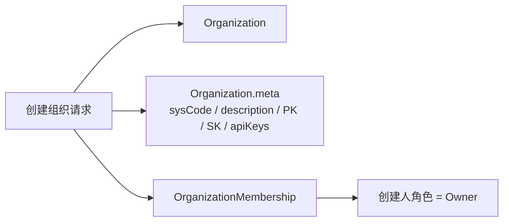

# 基于 Langfuse 的组织管理模块需求描述

## 1. 背景与目标

组织是评测平台的顶层管理单元，用于承载组织成员、组织角色、项目列表以及后续项目级权限继承关系。为降低二次建设成本，组织管理模块应尽量沿用 Langfuse 开源版的组织、成员、角色和项目关系模型，在平台侧仅补充业务需要的扩展字段和展示流程。

本模块第一版目标：

- 用户登录后右上角展示当前用户信息，并提供用户有权限组织的切换入口。
- 默认选中用户有权限访问的第一个组织；如果用户没有任何组织权限，展示友好空状态并提示需要授权后才能切换组织。
- 支持创建组织，并在创建时绑定业务子系统。
- 支持基于当前选中组织展示组织管理信息。
- 组织管理页面参考 Langfuse 项目设置页的设置型布局，按“组织信息、组织人员、API Key 管理”分区展示。
- 支持添加组织成员，并按当前操作者角色限制可授予的组织角色。
- 支持在组织人员中查询用户、新增用户并授予组织角色。
- 支持删除组织成员，仅 `Owner`、`Admin` 可操作。
- 支持批量导入组织成员，提供导入模板、导入校验和失败提示。
- 支持组织级 API Key 查询、新增、删除。
- 支持编辑组织描述和绑定子系统，不支持修改组织名称。
- 创建组织成功后，默认将创建人授予该组织的 `Owner` 角色。
- 创建组织成功后，默认生成组织级 `PK/SK`，用于后续访问该组织下所有项目 API。

参考资料：

- [Langfuse Access Control (RBAC)](https://langfuse.com/docs/administration/rbac)

## 2. 范围说明

### 2.1 本期范围

| 功能域 | 功能点 | 说明 |
| --- | --- | --- |
| 全局上下文 | 用户信息展示 | 登录后右上角展示当前用户信息 |
| 全局上下文 | 组织切换 | 支持切换当前用户有权限访问的组织 |
| 组织创建 | 创建组织 | 输入组织名称、绑定子系统、组织描述 |
| 组织信息 | 查看组织信息 | 展示当前选中组织的基础信息 |
| 组织信息 | 编辑组织信息 | 编辑组织描述和绑定子系统，不允许修改组织名称 |
| 组织人员 | 查看组织成员 | 展示当前选中组织成员列表 |
| 组织人员 | 查询用户 | 按姓名或邮箱查询平台用户，用于添加组织成员 |
| 组织人员 | 新增用户 | 新建平台用户并加入当前组织 |
| 成员管理 | 添加组织成员 | 输入姓名、邮件地址、组织角色 |
| 成员管理 | 删除组织成员 | Owner、Admin 可删除组织成员 |
| 成员管理 | 批量导入组织成员 | Owner、Admin 可导入，需提供模板并校验导入数据 |
| API Key 管理 | 查询 API Key | 查询当前组织下的组织级 API Key |
| API Key 管理 | 新增 API Key | 新增组织级 API Key |
| API Key 管理 | 删除 API Key | 删除组织级 API Key |
| 权限控制 | 角色授予限制 | Owner 可授予所有角色；Admin 最高授予 Admin；Member/Viewer 不可添加成员 |

### 2.2 非本期范围

- 删除或归档组织。
- 修改组织名称。
- 组织成员角色变更、禁用、邀请审批流程。
- 子系统字典管理。
- 组织级 API Key 轮换、禁用、审计日志、SSO、账单等高级组织设置。

## 3. 角色定义与授权规则

组织角色沿用 Langfuse 的组织级角色体系：

| 角色 | 角色编码 | 角色定位 |
| --- | --- | --- |
| Owner | `OWNER` | 组织最高管理员，可管理组织成员并授予所有组织角色 |
| Admin | `ADMIN` | 组织管理员，可管理组织成员，但不能授予 Owner |
| Member | `MEMBER` | 组织普通成员，可查看组织和其有权限的项目，不可管理组织成员 |
| Viewer | `VIEWER` | 组织只读成员，仅具备查看权限，不可管理组织成员 |

角色授予与管理规则：

| 当前操作者组织角色 | 可添加/新增成员 | 可删除成员 | 可批量导入成员 | 可管理 API Key | 可授予角色 |
| --- | --- | --- | --- | --- | --- |
| Owner | 是 | 是 | 是 | 是 | Owner、Admin、Member、Viewer |
| Admin | 是 | 是 | 是 | 是 | Admin、Member、Viewer |
| Member | 否 | 否 | 否 | 否 | 无 |
| Viewer | 否 | 否 | 否 | 否 | 无 |

默认规则：

- 创建组织成功后，系统自动为创建人创建组织成员关系。
- 创建人的组织角色默认为 `Owner`。
- 创建组织成功后，系统自动生成组织级 `PK/SK`，生成规则沿用 Langfuse Project 的 `PK/SK` 生成算法。
- 组织级 `PK/SK` 用于后续访问该组织下所有项目的 API；具体鉴权时应校验目标项目是否属于该组织。
- 同一用户在同一组织内只能拥有一个组织角色。
- 角色授予不得高于当前操作者自身角色等级。

## 4. 数据模型设计

### 4.1 沿用 Langfuse 原生模型

| 模型 | 用途 | 说明 |
| --- | --- | --- |
| `Organization` | 组织基础信息 | 沿用组织 ID、组织名称、创建时间等基础字段 |
| `OrganizationMembership` | 组织成员关系 | 记录用户与组织的关系及组织角色 |
| `User` | 用户基础信息 | 沿用用户 ID、姓名、邮箱等字段 |
| `Project` | 项目基础信息 | 组织下的项目列表仍挂载在组织维度 |

### 4.2 组织 meta 扩展字段

为尽量沿用 Langfuse 开源版数据模型，组织管理模块不新增独立组织扩展表。创建或修改组织时，将平台业务扩展信息写入 `Organization.meta` JSON 列。

建议 `meta` 结构：

```json
{
  "sysCode": "eval-platform",
  "description": "用于 Agent 评测业务线",
  "publicKey": "pk-lf-xxxxxxxx",
  "secretKey": "sk-lf-xxxxxxxx",
  "apiKeys": [
    {
      "id": "org_key_xxx",
      "name": "Default organization key",
      "publicKey": "pk-lf-xxxxxxxx",
      "secretKey": "sk-lf-xxxxxxxx",
      "createdAt": "2026-07-02T10:00:00Z",
      "createdBy": "user_xxx",
      "deletedAt": null
    }
  ]
}
```

字段说明：

| meta key | 类型 | 必填 | 写入时机 | 说明 |
| --- | --- | --- | --- | --- |
| `sysCode` | string | 是 | 创建、编辑 | 绑定子系统编码 |
| `description` | string | 否 | 创建、编辑 | 组织描述 |
| `publicKey` | string | 是 | 创建 | 组织级 PK，按 Langfuse Project PK 生成算法产生 |
| `secretKey` | string | 是 | 创建 | 组织级 SK，按 Langfuse Project SK 生成算法产生 |
| `apiKeys` | array | 是 | 创建、API Key 管理 | 组织级 API Key 列表，默认包含创建组织时生成的一组 PK/SK |

安全要求：

- `secretKey` 属于敏感凭据，前端仅在创建成功时展示一次完整值，后续只展示脱敏值。
- `Organization.meta.apiKeys[].secretKey` 同样属于敏感凭据，查询列表时仅返回脱敏值。
- 如当前 Langfuse 开源版项目密钥在数据库中采用加密存储，组织级 `secretKey` 应复用相同加密方式后再写入 `meta`。
- 使用组织级 `PK/SK` 调用项目 API 时，后端必须校验请求项目归属于该组织，不能仅凭 key 放行。
- `publicKey`、`secretKey` 可作为默认组织 Key 的兼容字段；后续组织级 API Key 管理以 `apiKeys` 列表为准。

### 4.3 创建组织数据写入关系



## 5. 功能需求

### 5.1 登录用户信息与组织切换

入口：

- 用户登录成功后，平台右上角展示当前用户信息和组织切换器。

展示内容：

| 区域 | 内容 | 说明 |
| --- | --- | --- |
| 用户信息 | 用户名称、邮箱或头像 | 来自登录态用户信息 |
| 组织切换器 | 当前组织名称、可切换组织列表 | 仅展示当前用户有权限访问的组织 |

默认选中规则：

1. 登录成功后查询当前用户有权限访问的组织列表。
2. 如果组织列表非空，默认选中查询结果中的第一个组织。
3. 如果用户上一次选择过组织，且该用户仍拥有该组织权限，可优先恢复上一次选择。
4. 如果组织列表为空，不选中任何组织，并展示友好提示。

无组织权限提示：

- 组织管理页展示空状态，例如“当前账号暂无可访问组织，请联系管理员授权后再使用组织管理”。
- 组织切换器置灰或展示“暂无可切换组织”。
- 组织信息、组织人员、API Key 管理三个分区不展示业务数据。
- 后端接口仍需返回空列表或无权限错误，不能仅依赖前端状态。

组织切换规则：

- 用户手动切换组织后，组织管理页刷新为该组织对应的组织信息、组织人员和 API Key 数据。
- 当前组织 ID 应作为组织信息查询、成员管理、API Key 管理等操作的上下文参数。
- 用户不得通过手动构造请求访问未授权组织。

### 5.2 创建组织

入口：

- 组织管理页面点击“创建组织”。

输入字段：

| 字段 | 必填 | 校验规则 |
| --- | --- | --- |
| 组织名称 | 是 | 不能为空；同一平台内建议唯一或同一用户可见范围内唯一 |
| 绑定子系统 | 是 | 必须从可选子系统列表中选择 |
| 组织描述 | 否 | 建议限制长度，例如 500 字以内 |

处理逻辑：

1. 校验当前用户是否具备创建组织的入口权限。
2. 创建 Langfuse 原生组织记录。
3. 按 Langfuse Project 的 `PK/SK` 生成算法生成组织级 `publicKey` 和 `secretKey`。
4. 写入 `Organization.meta`：`sysCode`、`description`、`publicKey`、`secretKey`、`apiKeys`。
5. 创建组织成员关系，将创建人加入该组织。
6. 将创建人的组织角色设置为 `Owner`。
7. 返回创建后的组织详情；创建成功响应中可返回一次完整 `secretKey`。

成功结果：

- 组织切换器中出现新组织，并可切换到该组织。
- 创建人可进入该组织并执行 Owner 可执行的组织管理操作。
- 组织 `meta` 中存在 `sysCode`、`description`、组织级 `publicKey`、组织级 `secretKey` 和默认 `apiKeys`。

异常处理：

| 场景 | 处理方式 |
| --- | --- |
| 组织名称为空 | 前端阻断并提示“请输入组织名称” |
| 未选择绑定子系统 | 前端阻断并提示“请选择绑定子系统” |
| 组织名称重复 | 后端返回冲突错误，前端提示“组织名称已存在” |
| 创建成员关系失败 | 回滚组织创建，避免出现无 Owner 组织 |
| PK/SK 生成失败 | 回滚组织创建并提示“组织密钥生成失败” |

### 5.3 组织设置首页

入口：

- 用户登录成功并选中组织后进入组织管理页面。

展示范围：

- 展示当前选中组织的信息、人员和 API Key 管理能力。
- 当前组织来自右上角组织切换器，而不是在组织管理页内重复展示全量组织列表。

页面布局：

- 参考 Langfuse 项目设置页的设置型布局，建议左侧或顶部为设置分区导航，右侧为当前分区内容。
- 分区包括：组织信息、组织人员、API Key 管理。
- 页面顶部应展示当前组织名称和当前用户在该组织内的角色。

组织信息字段：

| 字段 | 说明 |
| --- | --- |
| 组织名称 | 来自 Langfuse `Organization.name` |
| 绑定子系统 | 来自 `Organization.meta.sysCode` |
| 组织描述 | 来自 `Organization.meta.description` |
| 当前用户组织角色 | 当前用户在该组织的 `Owner/Admin/Member/Viewer` |
| 成员数量 | 组织成员数量 |
| 项目数量 | 组织下项目数量 |
| 创建时间 | 组织创建时间 |

分区操作：

| 操作 | Owner | Admin | Member | Viewer |
| --- | --- | --- | --- | --- |
| 查看组织信息 | 显示并可进入 | 显示并可进入 | 显示并可进入 | 显示并可进入 |
| 编辑组织信息 | 显示并可进入 | 显示并可进入 | 不显示或置灰 | 不显示或置灰 |
| 组织人员 | 显示并可进入 | 显示并可进入 | 仅查看或置灰 | 仅查看或置灰 |
| API Key 管理 | 显示并可进入 | 显示并可进入 | 不显示或置灰 | 不显示或置灰 |

### 5.4 组织人员管理

入口：

- 组织管理页点击“组织人员”分区。

权限：

- `Owner` 可进入成员管理并添加成员。
- `Admin` 可进入成员管理并添加成员，但不能授予 `Owner`。
- `Owner`、`Admin` 可删除组织成员。
- `Owner`、`Admin` 可批量导入组织成员。
- `Member` 和 `Viewer` 可按产品策略只读查看成员列表，不允许添加、删除或导入组织成员。

添加成员输入字段：

| 字段 | 必填 | 校验规则 |
| --- | --- | --- |
| 姓名 | 是 | 不能为空 |
| 邮件地址 | 是 | 必须为合法邮箱格式 |
| 组织角色 | 是 | 必须在当前操作者可授予角色范围内 |

处理逻辑：

1. 校验当前用户在该组织内是否为 `Owner` 或 `Admin`。
2. 根据当前用户角色计算可授予角色列表。
3. 校验提交的目标角色是否在可授予范围内。
4. 根据邮箱查询用户是否已存在。
5. 如用户不存在，按平台用户策略创建用户或生成邀请记录。
6. 创建或更新该用户与组织的成员关系。
7. 返回最新成员列表。

查询用户规则：

- 支持按姓名、邮件地址查询平台用户。
- 查询结果用于添加组织成员时选择用户。
- 查询结果不得泄露用户敏感信息，建议仅展示姓名、邮箱、用户状态。
- 如果邮箱不存在，`Owner`、`Admin` 可选择新增用户并加入当前组织。

新增用户规则：

- `Owner`、`Admin` 可新增用户并加入当前组织。
- 新增用户输入字段：姓名、邮件地址、组织角色。
- 组织角色仍需遵循角色授予约束。
- 如果邮箱已存在平台用户，则不重复创建用户，改为提示添加已有用户到组织。

成员添加规则：

- `Owner` 添加成员时，可选择 `Owner/Admin/Member/Viewer`。
- `Admin` 添加成员时，可选择 `Admin/Member/Viewer`，不可选择 `Owner`。
- `Member`、`Viewer` 不允许添加成员。
- 如果目标邮箱已是组织成员，应提示“该用户已在组织中”，不重复创建成员关系。

删除成员规则：

- `Owner`、`Admin` 可删除组织成员。
- `Admin` 不允许删除 `Owner` 成员。
- 不允许删除组织内最后一个 `Owner`，避免组织失去所有者。
- 成员删除后，该用户不再继承该组织下项目的组织级默认权限；若该用户在某项目存在项目级角色，项目级角色是否保留需按项目成员模型单独处理。

批量导入规则：

- `Owner`、`Admin` 可批量导入组织成员。
- 系统默认提供导入模板。
- 导入文件建议使用 `.xlsx` 或 `.csv` 格式。
- 导入模板字段：姓名、邮件地址、组织角色。
- 导入前必须完成数据校验；校验通过后才允许提交导入。
- 导入角色必须遵循角色授予约束：`Owner` 可导入 `Owner/Admin/Member/Viewer`，`Admin` 只能导入 `Admin/Member/Viewer`。
- 如校验不通过，弹窗提示失败原因，并标明失败行号、字段和原因。

批量导入校验规则：

| 校验项 | 规则 | 失败提示示例 |
| --- | --- | --- |
| 姓名 | 不能为空 | 第 3 行：姓名不能为空 |
| 邮件地址 | 不能为空且必须为合法邮箱格式 | 第 4 行：邮件地址格式不正确 |
| 组织角色 | 必须为 Owner/Admin/Member/Viewer | 第 5 行：组织角色不合法 |
| 角色授予 | 不得高于当前操作者可授予范围 | 第 6 行：Admin 不能导入 Owner 角色 |
| 重复成员 | 文件内重复或已在组织中 | 第 7 行：该邮箱已在组织中 |

### 5.5 编辑组织信息

入口：

- 组织管理页点击“组织信息”分区中的编辑入口。

权限：

- `Owner`、`Admin` 可编辑组织扩展信息。
- `Member`、`Viewer` 不允许编辑。

可编辑字段：

| 字段 | 是否可编辑 | 说明 |
| --- | --- | --- |
| 组织名称 | 否 | 创建后不支持修改 |
| 绑定子系统 | 是 | 支持重新绑定 |
| 组织描述 | 是 | 支持修改 |

处理逻辑：

1. 校验当前用户是否为该组织 `Owner` 或 `Admin`。
2. 禁止提交组织名称修改。
3. 更新 `Organization.meta.sysCode` 和 `Organization.meta.description`。
4. 返回更新后的组织详情。

异常处理：

| 场景 | 处理方式 |
| --- | --- |
| 尝试修改组织名称 | 后端忽略该字段或返回错误 |
| 绑定子系统为空 | 返回参数校验错误 |
| 无权限用户调用接口 | 返回无权限错误 |

### 5.6 API Key 管理

入口：

- 组织管理页点击“API Key 管理”分区。

权限：

- `Owner`、`Admin` 可查询、新增、删除组织级 API Key。
- `Member`、`Viewer` 不允许管理组织级 API Key。

列表字段：

| 字段 | 说明 |
| --- | --- |
| Key 名称 | API Key 展示名称 |
| Public Key | 完整展示或按安全策略展示 |
| Secret Key | 仅创建成功时展示一次完整值，列表中展示脱敏值 |
| 创建人 | API Key 创建人 |
| 创建时间 | API Key 创建时间 |
| 状态 | 正常、已删除 |

处理逻辑：

1. 查询 API Key 时，读取当前组织 `Organization.meta.apiKeys` 中未删除的 Key。
2. 新增 API Key 时，按 Langfuse Project 的 `PK/SK` 生成算法生成组织级 `publicKey` 和 `secretKey`。
3. 将新 Key 追加写入 `Organization.meta.apiKeys`。
4. 删除 API Key 时，将对应 Key 标记为删除，建议写入 `deletedAt`，避免物理移除影响审计。
5. 返回列表时，`secretKey` 只返回脱敏值。

异常处理：

| 场景 | 处理方式 |
| --- | --- |
| 无权限查询 API Key | 返回无权限错误 |
| 无权限新增 API Key | 返回无权限错误 |
| 无权限删除 API Key | 返回无权限错误 |
| API Key 不存在 | 返回资源不存在 |
| 删除默认最后一个 API Key | 可按产品策略阻断，避免组织无可用 Key |

## 6. API 设计建议

为兼容 Langfuse 开源版，建议平台 API 层优先复用 Langfuse 原有组织、成员、角色数据模型；对绑定子系统、组织描述和组织级 `PK/SK` 使用 `Organization.meta` JSON 承接。

### 6.1 查询用户可切换组织列表

```http
GET /api/me/organizations
```

处理要求：

- 登录成功后调用，用于右上角用户信息和组织切换器。
- 仅返回当前用户有权限访问的组织。
- 如果列表非空，前端默认选中第一条；如果为空，前端展示无组织权限提示。

响应体：

```json
{
  "currentUser": {
    "id": "user_xxx",
    "name": "张三",
    "email": "zhangsan@example.com"
  },
  "organizations": [
    {
      "id": "org_xxx",
      "name": "示例组织",
      "role": "OWNER"
    }
  ],
  "defaultOrgId": "org_xxx"
}
```

### 6.2 创建组织

```http
POST /api/organizations
```

请求体：

```json
{
  "name": "示例组织",
  "sysCode": "eval-platform",
  "description": "用于 Agent 评测业务线"
}
```

响应体：

```json
{
  "id": "org_xxx",
  "name": "示例组织",
  "sysCode": "eval-platform",
  "description": "用于 Agent 评测业务线",
  "publicKey": "pk-lf-xxxxxxxx",
  "secretKey": "sk-lf-xxxxxxxx",
  "currentUserRole": "OWNER"
}
```

### 6.3 查询当前组织详情

```http
GET /api/organizations/{orgId}
```

响应体：

```json
{
  "id": "org_xxx",
  "name": "示例组织",
  "sysCode": "eval-platform",
  "description": "用于 Agent 评测业务线",
  "publicKey": "pk-lf-xxxxxxxx",
  "currentUserRole": "OWNER",
  "memberCount": 12,
  "projectCount": 3,
  "createdAt": "2026-07-02T10:00:00Z"
}
```

### 6.4 查询组织成员

```http
GET /api/organizations/{orgId}/members
```

请求参数：

| 参数 | 必填 | 说明 |
| --- | --- | --- |
| `keyword` | 否 | 按姓名或邮箱搜索组织成员 |

### 6.5 查询平台用户

```http
GET /api/users/search
```

请求参数：

| 参数 | 必填 | 说明 |
| --- | --- | --- |
| `keyword` | 是 | 按姓名或邮箱查询用户 |

处理要求：

- 仅 `Owner`、`Admin` 可在添加成员流程中查询用户。
- 查询结果仅返回添加成员所需的基础字段。

### 6.6 新增平台用户并加入组织

```http
POST /api/organizations/{orgId}/users
```

请求体：

```json
{
  "name": "张三",
  "email": "zhangsan@example.com",
  "role": "MEMBER"
}
```

处理要求：

- 校验当前用户为 `Owner` 或 `Admin`。
- 如果邮箱已存在平台用户，则不重复创建用户。
- 创建或复用用户后，将其加入当前组织。
- 角色授予必须遵循当前操作者的角色授予约束。

### 6.7 添加组织成员

```http
POST /api/organizations/{orgId}/members
```

请求体：

```json
{
  "name": "张三",
  "email": "zhangsan@example.com",
  "role": "MEMBER"
}
```

响应体：

```json
{
  "id": "membership_xxx",
  "orgId": "org_xxx",
  "name": "张三",
  "email": "zhangsan@example.com",
  "role": "MEMBER"
}
```

### 6.8 编辑组织扩展信息

```http
PATCH /api/organizations/{orgId}
```

请求体：

```json
{
  "sysCode": "new-subsystem",
  "description": "更新后的组织描述"
}
```

响应体：

```json
{
  "id": "org_xxx",
  "name": "示例组织",
  "sysCode": "new-subsystem",
  "description": "更新后的组织描述"
}
```

### 6.9 删除组织成员

```http
DELETE /api/organizations/{orgId}/members/{membershipId}
```

处理要求：

- 校验当前用户为 `Owner` 或 `Admin`。
- `Admin` 不允许删除 `Owner`。
- 不允许删除组织最后一个 `Owner`。

响应体：

```json
{
  "success": true
}
```

### 6.10 下载组织成员导入模板

```http
GET /api/organizations/{orgId}/members/import-template
```

模板字段：

| 字段 | 必填 | 示例 |
| --- | --- | --- |
| 姓名 | 是 | 张三 |
| 邮件地址 | 是 | zhangsan@example.com |
| 组织角色 | 是 | MEMBER |

### 6.11 批量导入组织成员

```http
POST /api/organizations/{orgId}/members/import
```

处理要求：

- 校验当前用户为 `Owner` 或 `Admin`。
- 解析导入文件并逐行校验。
- 校验失败时不写入数据，返回失败行号、字段和原因。
- 校验通过后批量创建组织成员关系。

失败响应示例：

```json
{
  "success": false,
  "errors": [
    {
      "row": 6,
      "field": "组织角色",
      "message": "Admin 不能导入 Owner 角色"
    }
  ]
}
```

### 6.12 查询组织级 API Key

```http
GET /api/organizations/{orgId}/api-keys
```

处理要求：

- 校验当前用户为 `Owner` 或 `Admin`。
- 仅读取当前组织下未删除的 API Key。
- `secretKey` 仅返回脱敏值。

### 6.13 新增组织级 API Key

```http
POST /api/organizations/{orgId}/api-keys
```

请求体：

```json
{
  "name": "后台服务调用 Key"
}
```

处理要求：

- 校验当前用户为 `Owner` 或 `Admin`。
- 按 Langfuse Project 的 `PK/SK` 生成算法生成组织级 Key。
- 将新 Key 写入 `Organization.meta.apiKeys`。
- 创建成功响应中可返回一次完整 `secretKey`。

### 6.14 删除组织级 API Key

```http
DELETE /api/organizations/{orgId}/api-keys/{keyId}
```

处理要求：

- 校验当前用户为 `Owner` 或 `Admin`。
- 将对应 Key 标记为删除，建议写入 `deletedAt`。
- 删除后该 Key 不可继续调用组织下项目 API。

## 7. 页面交互要求

### 7.1 全局用户信息与组织切换

- 页面右上角展示当前用户信息。
- 页面右上角提供组织切换器，仅展示当前用户有权限访问的组织。
- 默认选中查询结果中的第一个组织。
- 如果用户没有任何组织权限，展示友好提示，并禁用组织切换器。
- 用户切换组织后，组织管理页刷新为新组织的组织信息、组织人员和 API Key 管理数据。

### 7.2 组织管理设置页

- 页面采用设置型布局，参考 Langfuse 项目设置页的体验。
- 页面顶部展示当前组织名称、当前用户组织角色。
- 设置分区包括：组织信息、组织人员、API Key 管理。
- `Owner/Admin` 可看到组织信息编辑、组织人员管理、API Key 管理操作。
- `Member/Viewer` 仅展示其有权限查看的信息，无权限操作不展示或置灰。

### 7.3 创建组织弹窗

- 字段顺序：组织名称、绑定子系统、组织描述。
- 创建成功后关闭弹窗并刷新组织切换器。
- 创建成功后，新组织的当前用户角色显示为 `Owner`。

### 7.4 组织人员分区

- 展示组织成员列表。
- 支持按姓名、邮箱查询组织成员。
- 支持查询平台用户，用于添加已有用户为组织成员。
- 支持新增平台用户并加入当前组织。
- 提供“添加成员”入口。
- 提供“删除成员”操作。
- 提供“批量导入”入口和“下载导入模板”入口。
- 添加成员时，组织角色下拉选项需要根据当前操作者角色动态过滤。
- 批量导入校验失败时，弹窗展示失败原因；建议支持下载失败明细。

### 7.5 组织信息分区

- 组织名称只读展示。
- 绑定子系统可修改。
- 组织描述可修改。
- 保存成功后刷新当前组织信息。

### 7.6 API Key 管理分区

- 展示当前组织下未删除的组织级 API Key 列表。
- 提供“新增 API Key”入口。
- 提供“删除 API Key”操作。
- 新增成功后仅展示一次完整 `secretKey`，关闭弹窗后不再明文展示。
- 列表中的 `secretKey` 仅展示脱敏值。
- 删除 API Key 前必须弹出二次确认。

## 8. 权限校验要求

所有权限校验必须在后端执行，前端按钮展示只作为体验优化。

| 操作 | 后端校验 |
| --- | --- |
| 创建组织 | 校验用户登录态和平台创建组织策略 |
| 查询用户可切换组织 | 仅返回当前用户具备成员关系的组织 |
| 查看当前组织详情 | 校验当前用户具备目标组织成员关系 |
| 查询组织成员 | 校验当前用户具备目标组织成员关系 |
| 查询平台用户 | 校验当前用户为 Owner 或 Admin |
| 新增平台用户并加入组织 | 校验当前用户为 Owner 或 Admin，并校验目标角色不高于可授予范围 |
| 添加组织成员 | 校验当前用户为 Owner 或 Admin，并校验目标角色不高于可授予范围 |
| 删除组织成员 | 校验当前用户为 Owner 或 Admin；Admin 不能删除 Owner；不能删除最后一个 Owner |
| 批量导入组织成员 | 校验当前用户为 Owner 或 Admin，并逐行校验角色授予范围 |
| 编辑组织 | 校验当前用户为 Owner 或 Admin |
| 查询组织级 API Key | 校验当前用户为 Owner 或 Admin |
| 新增组织级 API Key | 校验当前用户为 Owner 或 Admin |
| 删除组织级 API Key | 校验当前用户为 Owner 或 Admin |
| 修改组织名称 | 一律拒绝 |

## 9. 验收标准

| 场景 | 预期结果 |
| --- | --- |
| 用户登录且存在组织权限 | 右上角展示用户信息和组织切换器，默认选中第一个组织 |
| 用户没有任何组织权限 | 组织管理页展示友好提示，组织信息、人员、API Key 数据不展示 |
| 用户手动切换组织 | 组织管理页刷新为切换后组织的信息、人员和 API Key 数据 |
| 用户创建组织 | 创建成功，组织切换器出现新组织，创建人为 Owner |
| 用户创建组织 | `Organization.meta.sysCode` 写入绑定子系统值 |
| 用户创建组织 | 自动生成组织级 PK/SK 并写入 `Organization.meta` |
| 创建组织未填名称 | 创建失败并提示必填 |
| 创建组织未绑定子系统 | 创建失败并提示必填 |
| Owner 添加 Owner 成员 | 添加成功 |
| Owner 添加 Admin/Member/Viewer 成员 | 添加成功 |
| Admin 添加 Owner 成员 | 添加失败 |
| Admin 添加 Admin/Member/Viewer 成员 | 添加成功 |
| Member 添加组织成员 | 操作入口不可见或接口返回无权限 |
| Viewer 添加组织成员 | 操作入口不可见或接口返回无权限 |
| Owner/Admin 查询平台用户 | 返回可添加用户基础信息 |
| Owner/Admin 新增平台用户并加入组织 | 用户创建或复用成功，并加入当前组织 |
| Admin 新增 Owner 用户 | 创建失败，提示无权授予 Owner |
| Owner/Admin 删除普通组织成员 | 删除成功 |
| Admin 删除 Owner 成员 | 删除失败 |
| 删除组织最后一个 Owner | 删除失败 |
| Owner 批量导入 Owner/Admin/Member/Viewer | 导入成功 |
| Admin 批量导入 Admin/Member/Viewer | 导入成功 |
| Admin 批量导入 Owner | 校验失败，弹窗提示失败行和原因 |
| 批量导入数据格式错误 | 不写入数据，弹窗提示失败原因 |
| Owner/Admin 编辑组织描述 | 编辑成功 |
| Owner/Admin 修改绑定子系统 | 编辑成功，更新 `Organization.meta.sysCode` |
| Owner/Admin 修改组织名称 | 修改失败或字段被忽略 |
| Member/Viewer 编辑组织 | 操作入口不可见或接口返回无权限 |
| Owner/Admin 查询组织级 API Key | 返回当前组织未删除 Key 列表，Secret Key 脱敏 |
| Owner/Admin 新增组织级 API Key | 新增成功，并仅一次性展示完整 Secret Key |
| Owner/Admin 删除组织级 API Key | 删除成功，Key 标记为删除后不可继续使用 |
| Member/Viewer 管理组织级 API Key | 操作入口不可见或接口返回无权限 |

## 10. 设计约束

- 组织名称创建后不可修改，避免影响组织识别、审计记录和外部系统映射。
- 绑定子系统、组织描述、组织级 PK/SK 属于平台业务扩展，统一写入 `Organization.meta` JSON。
- 组织成员和组织角色应优先沿用 Langfuse 原有组织成员关系模型。
- 组织级 PK/SK 的生成算法应沿用 Langfuse Project PK/SK 生成算法，便于和现有 API Key 格式保持一致。
- 组织级 API Key 管理以 `Organization.meta.apiKeys` 为准，默认创建的 PK/SK 可作为首个组织级 API Key。
- 组织级 PK/SK 的访问范围是组织下所有项目；后端 API 鉴权必须校验目标项目归属组织。
- 角色授权规则必须同时在前端选项过滤和后端接口校验中实现。
- 项目管理和组织管理必须共享同一个当前选中组织上下文。
- 后续如果接入项目管理模块，项目列表与项目权限应继续基于组织成员关系和项目成员关系共同判断。
