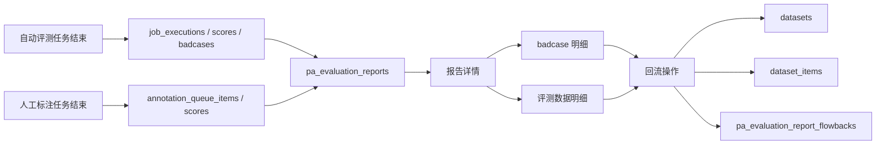

# 评测报告模块需求描述

日期：2026-07-03

## 1. 背景与目标

评测报告模块用于在自动评测任务和人工标注任务结束后自动生成报告，沉淀本次任务的评测结论、质量表现、badcase 明细和数据回流建议。模块设计严格参考 Langfuse 社区版 Evaluators、Job Executions、Scores、Annotation Queues、Datasets 与 Dataset Items 的数据结构和 API 能力，优先复用 Langfuse 原生数据作为报告事实来源，Plus 层仅新增报告快照、报告状态和回流记录等 PA 扩展能力。

本期目标：

- 自动评测任务结束后自动生成评测报告。
- 人工标注任务结束后自动生成评测报告。
- 查询报告列表和报告详情。
- 报告内容结合行业实践，覆盖任务摘要、数据来源、指标定义、总体结果、分组分析、badcase、代表样本、风险限制和改进建议。
- 报告中支持将本次任务的 badcase 数据回流到数据集。
- badcase 回流目标数据集支持选择已有数据集或重新创建数据集。
- 重新创建 badcase 数据集时，系统默认生成容易理解的数据集名称。
- 报告中支持将本次任务的评测数据回流到指定数据集。
- 回流操作复用 Langfuse `datasets` 与 `dataset_items`，不修改 Langfuse 原生表结构。

## 2. 设计原则

- Langfuse 事实数据优先：报告内容从 Langfuse 原生任务、执行、评分、标注队列和数据集数据聚合生成。
- PA 只保存报告扩展：Langfuse 社区版没有通用评测报告主表，本期新增 `pa_` 前缀扩展表保存报告快照、生成状态和回流记录。
- 数据集回流复用原生能力：创建数据集复用 `datasets`，写入样本复用 `dataset_items`。
- 不改 Langfuse 原生表结构：禁止修改、删除或重命名 Langfuse 原生表字段。
- 回流可追溯：回流到数据集的每条 `dataset_items.metadata` 必须记录来源报告、来源任务、来源 score、来源 trace/observation/dataset item。
- 报告可复现：报告快照记录生成时的任务版本、过滤条件、评分阈值、统计口径和数据时间范围。
- 敏感数据谨慎展示：报告中长文本、prompt、output 可按权限和长度限制展示摘要，导出时遵循项目安全策略。

## 3. 范围说明

### 3.1 本期范围

| 功能域 | 功能点 | 说明 |
| --- | --- | --- |
| 报告生成 | 自动评测报告 | 自动评测任务结束后自动生成 |
| 报告生成 | 人工标注报告 | 人工标注任务结束后自动生成 |
| 报告查询 | 报告列表 | 按项目、来源类型、任务、状态查询 |
| 报告查询 | 报告详情 | 展示报告摘要、指标、分布、badcase、建议 |
| 报告导出 | 导出报告 | 支持 Markdown，PDF/HTML 可作为增强能力 |
| Badcase 回流 | 选择已有数据集 | 将报告内 badcase 写入已有 dataset |
| Badcase 回流 | 新建数据集 | 自动创建易懂名称的数据集后写入 badcase |
| 评测数据回流 | 回流到指定数据集 | 将本次任务评测数据写入用户选择的数据集 |
| 回流记录 | 查询回流历史 | 展示回流目标、数量、成功失败明细 |
| 权限审计 | 回流审计 | 记录报告生成、导出、回流等关键操作 |

### 3.2 非本期范围

- 报告在线多人批注。
- 报告版本对比。
- 自动生成 PowerPoint 或 Word。
- 跨项目报告汇总。
- 模型训练流水线自动触发。
- 修改 Langfuse 原生表结构。
- 物理删除源 trace、score、dataset item。

## 4. Langfuse 数据模型复用

### 4.1 自动评测来源

自动评测报告主要复用以下 Langfuse 与 PA 数据：

| 模型 | 用途 |
| --- | --- |
| `job_configurations` | 自动评测任务配置、评分名称、采样率、过滤条件 |
| `job_executions` | 单条执行记录、执行状态、输入对象、输出 score |
| `eval_templates` | 评估器名称、版本、类型、模型配置 |
| `scores` | 自动评测输出分数，`source = EVAL` |
| `datasets` / `dataset_items` | 数据来源为已有数据集时的样本信息 |
| `pa_auto_eval_tasks` | PA 自动评测任务扩展配置 |
| `pa_auto_eval_badcases` | 自动评测 badcase 识别结果 |

自动评测任务结束判定：

- `job_executions` 中不存在 `PENDING` 或 `DELAYED` 状态。
- 至少存在一条 `COMPLETED` 或 `ERROR` 执行记录。
- 对批量历史任务，关联 batch action 完成后再触发报告生成。
- 若任务被取消，仍可生成“已取消报告”，但需在报告摘要中标记任务未完整完成。

### 4.2 人工标注来源

人工标注报告主要复用以下 Langfuse 数据：

| 模型 | 用途 |
| --- | --- |
| `annotation_queues` | 人工标注任务基础信息和评分指标 |
| `annotation_queue_items` | 标注队列数据、完成状态、完成人、完成时间 |
| `annotation_queue_assignments` | 处理人配置 |
| `score_configs` | 评分指标定义 |
| `scores` | 人工评分结果，`source = ANNOTATION` |
| `datasets` / `dataset_items` | 已加入数据集的标注数据 |

人工标注任务结束判定：

- `annotation_queue_items.status = PENDING` 数量为 0。
- 队列总数据量大于 0。
- 若后续新增标注数据，任务再次完成后可生成新的报告版本。

### 4.3 scores

`scores` 是评测报告指标统计的核心来源。

| 字段 | 用途 |
| --- | --- |
| `id` | 分数 ID |
| `project_id` | 项目 ID |
| `name` | 指标名称 |
| `value` | numeric/boolean 分数统计 |
| `string_value` | categorical/text 统计 |
| `source` | 区分 `EVAL`、`ANNOTATION`、`API` |
| `trace_id` | 回溯 trace |
| `observation_id` | 回溯 observation |
| `config_id` | 关联 score config |
| `queue_id` | 人工标注队列 |
| `comment` | 标注或评估备注 |
| `created_at` | 评分时间 |

### 4.4 datasets 与 dataset_items

报告回流统一复用 Langfuse 数据集结构。

| 模型 | 用途 |
| --- | --- |
| `datasets` | 回流目标数据集 |
| `dataset_items` | 回流后的样本 |

回流写入 `dataset_items` 时建议字段映射：

| 字段 | 写入规则 |
| --- | --- |
| `input` | 优先写入原 dataset item input；若来源为 trace/observation，则从源对象 input 提取 |
| `expected_output` | 优先写入人工标注结果、期望输出或源对象 output；自动评测 badcase 可为空或写入建议修正值 |
| `metadata` | 写入报告来源、任务来源、badcase 原因、score 信息、回流批次 |
| `source_trace_id` | 来源 trace ID |
| `source_observation_id` | 来源 observation ID |
| `status` | 默认 `ACTIVE` |

回流 metadata 建议结构：

```json
{
  "source": "evaluation_report",
  "reportId": "report_xxx",
  "reportSourceType": "AUTO_EVAL",
  "sourceTaskId": "task_xxx",
  "sourceJobExecutionId": "job_execution_xxx",
  "sourceAnnotationQueueItemId": null,
  "sourceScoreIds": ["score_xxx"],
  "isBadcase": true,
  "badcaseReason": "answer_quality <= 0.6",
  "flowbackType": "BADCASE",
  "flowbackBatchId": "batch_xxx",
  "flowbackAt": "2026-07-03T10:00:00.000Z"
}
```

## 5. PA 扩展数据模型

Langfuse 社区版没有通用评测报告主表和回流批次表。本期新增 PA 扩展表，所有数据库变更必须通过 Alembic 迁移脚本实现并支持回滚。

### 5.1 pa_evaluation_reports

| 字段 | 类型 | 说明 |
| --- | --- | --- |
| `id` | string | 报告 ID |
| `project_id` | string | 项目 ID |
| `source_type` | string | `AUTO_EVAL` 或 `MANUAL_ANNOTATION` |
| `source_task_id` | string | 来源任务 ID；自动评测为 `pa_auto_eval_tasks.id` 或 `job_configurations.id`，人工标注为 `annotation_queues.id` |
| `source_native_id` | string | Langfuse 原生任务 ID，如 `job_configurations.id` 或 `annotation_queues.id` |
| `title` | string | 报告标题 |
| `status` | string | `GENERATING`、`READY`、`FAILED` |
| `summary` | json | 摘要统计 |
| `metrics` | json | 指标统计、分布和分组分析 |
| `badcases` | json | badcase 摘要与样本索引 |
| `recommendations` | json | 改进建议 |
| `content` | json | 报告结构化内容快照 |
| `content_markdown` | text nullable | Markdown 快照 |
| `generation_config` | json | 生成参数和统计口径 |
| `error_message` | text nullable | 生成失败原因 |
| `generated_by` | string nullable | 触发用户；系统自动生成可为空或为 system |
| `generated_at` | datetime nullable | 生成完成时间 |
| `created_at` | datetime | 创建时间 |
| `updated_at` | datetime | 更新时间 |

约束与索引：

- `project_id + source_type + source_task_id + created_at` 建索引。
- `project_id + status + created_at` 建索引。
- 同一任务可生成多个报告版本，但列表默认展示最新一版。

### 5.2 pa_evaluation_report_flowbacks

| 字段 | 类型 | 说明 |
| --- | --- | --- |
| `id` | string | 回流批次 ID |
| `project_id` | string | 项目 ID |
| `report_id` | string | `pa_evaluation_reports.id` |
| `flowback_type` | string | `BADCASE` 或 `EVALUATION_DATA` |
| `target_dataset_id` | string | 目标 dataset ID |
| `target_dataset_name` | string | 目标 dataset 名称 |
| `target_dataset_created` | boolean | 本次是否新建数据集 |
| `requested_count` | int | 请求回流数量 |
| `success_count` | int | 成功数量 |
| `failed_count` | int | 失败数量 |
| `status` | string | `PENDING`、`RUNNING`、`COMPLETED`、`PARTIAL_FAILED`、`FAILED` |
| `config` | json | 回流配置，如去重策略、字段映射 |
| `error_detail` | json nullable | 失败明细 |
| `created_by` | string | 操作人 |
| `created_at` | datetime | 创建时间 |
| `updated_at` | datetime | 更新时间 |

### 5.3 pa_evaluation_report_flowback_items

| 字段 | 类型 | 说明 |
| --- | --- | --- |
| `id` | string | 回流明细 ID |
| `project_id` | string | 项目 ID |
| `flowback_id` | string | 回流批次 ID |
| `report_id` | string | 报告 ID |
| `source_trace_id` | string nullable | 来源 trace ID |
| `source_observation_id` | string nullable | 来源 observation ID |
| `source_dataset_item_id` | string nullable | 来源 dataset item ID |
| `source_job_execution_id` | string nullable | 来源自动评测执行 ID |
| `source_annotation_queue_item_id` | string nullable | 来源人工标注队列数据 ID |
| `source_score_ids` | json | 来源 score ID 列表 |
| `target_dataset_item_id` | string nullable | 创建成功后的 dataset item ID |
| `is_badcase` | boolean | 是否 badcase |
| `status` | string | `SUCCESS` 或 `FAILED` |
| `error_message` | text nullable | 失败原因 |
| `created_at` | datetime | 创建时间 |

去重建议：

- 同一 `flowback_id + source_trace_id + source_observation_id + source_dataset_item_id` 不重复写入。
- 如果目标数据集中已存在同源 `metadata.reportId/sourceTaskId` 数据，默认跳过，可由用户选择“创建新版本”。

## 6. 报告内容要求

报告内容参考模型报告、数据集文档、数据卡和错误分析实践，强调可解释、可复现、可行动。

### 6.1 报告结构

| 模块 | 内容 |
| --- | --- |
| 报告摘要 | 报告标题、来源任务、来源类型、生成时间、任务状态、核心结论 |
| 任务配置 | 自动评测评估器/采样率/过滤条件，或人工标注评分指标/处理人 |
| 数据来源 | 来源数据集、trace 过滤条件、样本量、时间范围、环境、数据对象类型 |
| 指标定义 | score configs、score name、指标类型、阈值和 badcase 规则 |
| 总体结果 | 样本数、成功/失败/跳过数、平均分、中位数、分位数、通过率 |
| 分组分析 | 按环境、trace name、数据集、标注人、评估器、时间段等维度切片 |
| 分布分析 | 数值分布、分类占比、布尔通过率、文本评分摘要 |
| Badcase 分析 | badcase 数量、占比、原因分布、严重程度、代表样本 |
| 代表样本 | 高分样本、低分样本、边界样本、失败样本 |
| 人工标注质量 | 完成率、标注人产出、备注覆盖率、一致性指标 |
| 自动评测质量 | 执行成功率、错误类型、阻塞原因、评估器版本和模型信息 |
| 数据集沉淀 | 已回流数量、目标数据集、未回流数量、重复样本数量 |
| 风险与限制 | 数据偏差、样本覆盖不足、指标限制、评估器误判风险 |
| 改进建议 | 模型改进建议、prompt/工具调用建议、数据补充建议、指标优化建议 |
| 复现信息 | 任务 ID、报告 ID、筛选条件、时间范围、生成配置 |

### 6.2 自动评测报告指标

| 指标 | 口径 |
| --- | --- |
| 评测样本数 | `job_executions` 总数 |
| 成功数 | `status = COMPLETED` |
| 失败数 | `status = ERROR` |
| 取消数 | `status = CANCELLED` |
| 待执行数 | `status in (PENDING, DELAYED)`，结束报告中应为 0 |
| 执行成功率 | 成功数 / 总执行数 |
| 输出 score 覆盖率 | 有 `job_output_score_id` 的执行数 / 成功数 |
| 平均分/分位数 | numeric `scores.value` 聚合 |
| badcase 数 | `pa_auto_eval_badcases` 或阈值规则计算 |
| badcase 占比 | badcase 数 / 成功评分数 |
| 错误类型分布 | `job_executions.error` 聚合 |

### 6.3 人工标注报告指标

| 指标 | 口径 |
| --- | --- |
| 标注总量 | `annotation_queue_items` 总数 |
| 完成量 | `status = COMPLETED` |
| 完成率 | 完成量 / 总量 |
| 标注人产出 | 按 `annotator_user_id` 聚合完成量 |
| 备注覆盖率 | 有 `scores.comment` 的评分数 / 总评分数 |
| 评分分布 | 按 score config 和 score name 聚合 |
| 低分样本 | numeric score 低于阈值或 categorical 命中特定分类 |
| 一致性指标 | 有重复标注时计算一致率、Cohen's kappa、Krippendorff's alpha 等 |

### 6.4 Badcase 识别规则

自动评测 badcase：

- 优先读取 `pa_auto_eval_badcases`。
- 若无 badcase 表记录，但任务配置了 badcase 阈值，可按 `scores` 重新计算。
- numeric score 支持 `LT`、`LTE`、`GT`、`GTE`、`EQ`。
- categorical/boolean 可作为后续增强，本期可通过配置命中特定值。

人工标注 badcase：

- numeric score 默认可按低分阈值识别。
- boolean score 为 false 可识别为 badcase。
- categorical score 可配置某些分类为 badcase，例如 `bad`、`incorrect`、`unsafe`。
- 有备注的低分样本优先进入报告代表样本。

## 7. 功能需求

### 7.1 报告自动生成

自动评测任务结束后：

1. Plus 层监听或轮询任务状态。
2. 判断 `job_executions` 均进入终态。
3. 创建 `pa_evaluation_reports`，状态为 `GENERATING`。
4. 聚合 Langfuse 原生数据和 PA badcase 数据。
5. 写入报告快照，状态更新为 `READY`。
6. 生成失败时状态更新为 `FAILED`，记录错误。

人工标注任务结束后：

1. 用户完成最后一条标注数据后，或后台扫描已完成队列。
2. 判断 `annotation_queue_items` 已全部 `COMPLETED`。
3. 自动创建报告。
4. 报告生成后在任务详情和报告列表可见。

重复生成规则：

- 同一任务首次结束自动生成一版报告。
- 用户可手动重新生成最新报告。
- 同一任务多次报告使用创建时间区分版本，默认展示最新版本。

### 7.2 报告列表

列表字段：

| 字段 | 说明 |
| --- | --- |
| 报告标题 | `pa_evaluation_reports.title` |
| 来源类型 | 自动评测或人工标注 |
| 来源任务 | 任务名称和 ID |
| 报告状态 | `GENERATING`、`READY`、`FAILED` |
| 样本数 | `summary.totalCount` |
| badcase 数 | `summary.badcaseCount` |
| 已回流数 | 回流明细聚合 |
| 生成时间 | `generated_at` |
| 操作 | 查看、导出、重新生成、回流数据 |

筛选能力：

- 按来源类型筛选。
- 按报告状态筛选。
- 按任务名称搜索。
- 按生成时间筛选。
- 按是否存在 badcase 筛选。

### 7.3 报告详情

报告详情展示：

- 报告摘要卡片。
- 指标趋势和分布。
- 分组分析表。
- badcase 明细表。
- 全量评测数据表。
- 回流操作区。
- 回流历史。

badcase 明细字段：

| 字段 | 说明 |
| --- | --- |
| Trace ID | 来源 trace |
| Observation ID | 来源 observation |
| Dataset Item ID | 来源 dataset item |
| Score Name | 命中的评分指标 |
| Score Value | 分数值 |
| Badcase Reason | 命中原因 |
| Comment | 人工备注或评估说明 |
| Source Type | 自动评测或人工标注 |
| Actions | 查看源对象、回流到数据集 |

全量评测数据字段：

| 字段 | 说明 |
| --- | --- |
| Source ID | trace/observation/dataset item |
| Score Summary | 本条数据所有评分摘要 |
| Result Type | normal 或 badcase |
| Execution Status | 自动评测执行状态或人工标注状态 |
| Dataset Flowback Status | 是否已回流 |
| Actions | 查看源对象、回流到数据集 |

### 7.4 Badcase 回流到数据集

入口：

- 报告详情 badcase 区域顶部“回流 badcase”。
- badcase 明细表支持勾选后批量回流。
- 单条 badcase 支持单独回流。

目标数据集选择：

| 方式 | 说明 |
| --- | --- |
| 选择已有数据集 | 从当前项目已有数据集中选择 |
| 重新创建数据集 | 创建新 dataset 后写入 badcase |

新建数据集默认名称：

- 自动评测报告：`badcase-自动评测-{任务名称}-{YYYYMMDD}`
- 人工标注报告：`badcase-人工标注-{任务名称}-{YYYYMMDD}`
- 如果名称冲突，追加短后缀，例如 `-2` 或 `-{HHmm}`。

新建数据集默认 metadata：

```json
{
  "type": "badcase",
  "source": "evaluation_report",
  "reportId": "report_xxx",
  "sourceTaskId": "task_xxx",
  "sourceType": "AUTO_EVAL"
}
```

回流规则：

- 仅回流报告中被识别为 badcase 的数据。
- 默认跳过已经回流到同一目标数据集的同源样本。
- 用户可选择“跳过重复”或“创建新版本”。
- 回流成功后创建 `dataset_items`，并写入来源 metadata。
- 回流结果写入 `pa_evaluation_report_flowbacks` 与 `pa_evaluation_report_flowback_items`。

### 7.5 评测数据回流到指定数据集

入口：

- 报告详情全量评测数据区域顶部“回流评测数据”。
- 全量数据表支持筛选后批量回流。
- 支持按 normal、badcase、执行失败、分数区间等条件选择数据。

目标数据集：

- 必须由用户指定。
- 支持选择已有数据集。
- 支持新建数据集，默认名称：
  - 自动评测：`评测数据-自动评测-{任务名称}-{YYYYMMDD}`
  - 人工标注：`评测数据-人工标注-{任务名称}-{YYYYMMDD}`

回流范围：

| 范围 | 说明 |
| --- | --- |
| 全部评测数据 | 本次任务全部可回流数据 |
| 当前筛选结果 | 报告表格当前筛选后的数据 |
| 仅 badcase | 等同 badcase 回流 |
| 手动勾选 | 用户勾选的数据 |

写入规则：

- 来源为已有 dataset item 时，优先复制原 `input`、`expected_output`、`metadata`，并追加报告 metadata。
- 来源为 trace/observation 时，从源对象提取 `input` 和 `output`。
- 自动评测结果写入 `dataset_items.metadata.evaluationScores`。
- 人工标注结果写入 `dataset_items.metadata.annotationScores`。
- 如果无法提取 `input`，该条回流失败并进入失败明细，不影响其他数据。

## 8. API 设计

Plus 层对外响应统一遵循：

```json
{
  "code": 0,
  "message": "success",
  "data": {},
  "txId": "trace-id"
}
```

分页列表响应：

```json
{
  "code": 0,
  "message": "success",
  "data": {
    "total": 0,
    "datas": []
  },
  "txId": "trace-id"
}
```

### 8.1 查询报告列表

`GET /projects/{projectId}/evaluation-reports?page=1&pageSize=20&sourceType=AUTO_EVAL`

### 8.2 查询报告详情

`GET /projects/{projectId}/evaluation-reports/{reportId}`

### 8.3 手动重新生成报告

`POST /projects/{projectId}/evaluation-reports/regenerate`

请求体：

```json
{
  "sourceType": "AUTO_EVAL",
  "sourceTaskId": "task_xxx"
}
```

### 8.4 导出报告

`GET /projects/{projectId}/evaluation-reports/{reportId}/export?format=markdown`

### 8.5 查询报告 badcase

`GET /projects/{projectId}/evaluation-reports/{reportId}/badcases?page=1&pageSize=20`

### 8.6 查询报告评测数据

`GET /projects/{projectId}/evaluation-reports/{reportId}/items?page=1&pageSize=20&resultType=badcase`

### 8.7 预览回流

`POST /projects/{projectId}/evaluation-reports/{reportId}/flowbacks/preview`

请求体：

```json
{
  "flowbackType": "BADCASE",
  "range": "CURRENT_FILTER",
  "filters": {
    "scoreName": "answer_quality",
    "maxScore": 0.6
  },
  "targetDataset": {
    "mode": "CREATE",
    "name": "badcase-自动评测-客服回答质量评测-20260703",
    "description": "来自评测报告的 badcase 回流数据"
  },
  "dedupeStrategy": "SKIP_DUPLICATE"
}
```

响应 data：

```json
{
  "matchedCount": 25,
  "duplicateCount": 3,
  "willCreateCount": 22,
  "defaultDatasetName": "badcase-自动评测-客服回答质量评测-20260703"
}
```

### 8.8 执行回流

`POST /projects/{projectId}/evaluation-reports/{reportId}/flowbacks`

请求体：

```json
{
  "flowbackType": "BADCASE",
  "range": "SELECTED",
  "selectedItemIds": ["item_1", "item_2"],
  "targetDataset": {
    "mode": "EXISTING",
    "datasetId": "dataset_xxx"
  },
  "dedupeStrategy": "SKIP_DUPLICATE"
}
```

响应 data：

```json
{
  "flowbackId": "flowback_xxx",
  "status": "COMPLETED",
  "requestedCount": 2,
  "successCount": 2,
  "failedCount": 0,
  "targetDatasetId": "dataset_xxx"
}
```

### 8.9 查询回流历史

`GET /projects/{projectId}/evaluation-reports/{reportId}/flowbacks`

## 9. 数据流



### 9.1 报告生成数据流

1. 任务进入结束状态。
2. Plus 层创建 `pa_evaluation_reports`，状态为 `GENERATING`。
3. 聚合 Langfuse 原生数据、PA 任务扩展和 badcase 记录。
4. 生成结构化报告内容和 Markdown 快照。
5. 写入报告表并更新状态为 `READY`。
6. 若失败，写入 `FAILED` 和错误原因。

### 9.2 数据回流数据流

1. 用户在报告详情选择 badcase 或评测数据。
2. 用户选择已有数据集或新建数据集。
3. Plus 层执行回流预览，返回预计写入数量和重复数量。
4. 用户确认执行。
5. 如需新建数据集，先调用 Langfuse dataset 创建能力。
6. 对每条数据创建 `dataset_items`。
7. 写入回流批次和明细记录。
8. 返回成功数、失败数和失败明细。

## 10. 权限与安全

- 查看报告需要项目读取权限。
- 重新生成报告需要评测任务或标注任务管理权限。
- 回流到数据集需要数据集写入权限。
- 新建回流目标数据集需要数据集创建权限。
- 导出报告需要报告查看权限，并遵循项目数据导出权限。
- 回流操作必须记录审计日志。
- 报告中展示源 input/output 时应遵循项目脱敏和长度限制策略。
- 不在日志中输出完整 prompt、完整 output、API Key、模型密钥等敏感信息。
- SQL 必须使用参数绑定，外部输入必须使用 Pydantic schema 校验。

## 11. 异常处理

| 场景 | 处理 |
| --- | --- |
| 来源任务不存在 | 返回资源不存在 |
| 来源任务未结束 | 不生成正式报告，可返回当前进度 |
| 报告生成失败 | 状态置为 `FAILED`，记录错误摘要 |
| 报告无 badcase | badcase 回流按钮置灰或展示空状态 |
| 目标数据集不存在 | 返回业务错误 |
| 新建数据集名称冲突 | 自动追加后缀或提示用户修改 |
| 回流数据为空 | 阻止回流并提示 |
| 部分数据提取 input 失败 | 其他数据继续回流，失败明细写入回流记录 |
| 重复回流 | 按去重策略跳过或创建新版本 |
| dataset schema 校验失败 | 该条回流失败，返回字段路径和原因 |
| 无权限回流 | 返回无权限错误 |

## 12. 验收标准

- 自动评测任务结束后自动生成评测报告。
- 人工标注任务结束后自动生成评测报告。
- 可以查询报告列表和报告详情。
- 报告内容包含任务摘要、数据来源、指标定义、总体结果、分组分析、badcase、代表样本、风险限制、改进建议和复现信息。
- 报告 badcase 区域支持将 badcase 回流到数据集。
- badcase 回流支持选择已有数据集。
- badcase 回流支持重新创建数据集，并默认生成易懂的数据集名称。
- 报告全量评测数据支持回流到指定数据集。
- 回流写入 Langfuse `dataset_items`，并在 metadata 中记录报告来源和任务来源。
- 回流操作有预览、确认、成功失败统计和失败明细。
- 不修改 Langfuse 原生表结构。
- 新增 PA 表以 `pa_` 开头，并通过 Alembic 迁移支持回滚。

## 13. 参考资料

- Langfuse 社区版源码：`packages/shared/prisma/schema.prisma`
- Langfuse Dataset Public API：`web/src/features/public-api/types/datasets.ts`
- Langfuse Evaluation Rules / Evaluators Public API：`web/src/features/public-api/types/unstable-evaluation-rules.ts`、`unstable-evaluators.ts`
- Datasheets for Datasets：https://arxiv.org/abs/1803.09010
- Data Cards: Purposeful and Transparent Dataset Documentation for Responsible AI：https://arxiv.org/abs/2204.01075
- Model Cards for Model Reporting：https://arxiv.org/abs/1810.03993
