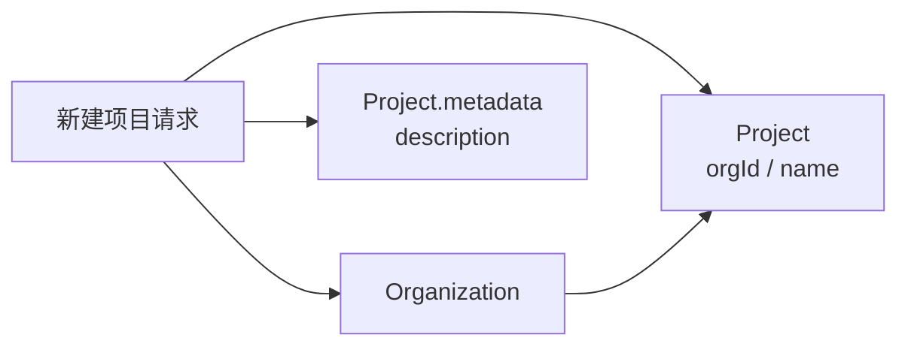

# 基于 Langfuse 的项目管理模块需求描述

## 1. 背景与目标

项目是评测平台承载 Trace、数据集、评分指标、模型配置、评测任务和报告的核心工作空间。为降低二次建设成本，项目管理模块应尽量沿用 Langfuse 开源版的组织、项目、成员和权限模型，在平台侧补充项目描述、搜索、卡片展示和跳转交互。

本模块第一版目标：

- 用户登录后右上角展示当前用户信息，并提供用户有权限组织的切换入口。
- 默认选中用户有权限访问的第一个组织；如果用户没有任何组织权限，展示友好空状态并提示需要授权后才能切换组织。
- 用户点击“项目管理”后，可以查询当前选中组织下有权限查看的所有项目。
- 项目管理模块根据当前选中组织展示该组织下的所有项目。
- 支持按项目名称、项目 ID 搜索当前组织下的项目。
- 支持新建项目，新建时选择当前用户已有组织权限的组织，并输入项目名称、项目描述。
- 支持项目归档与恢复，优先复用 Langfuse `Project.deletedAt` 表达归档状态。
- 项目描述写入 Langfuse `Project.metadata` JSON 字段；产品口径可称为 project 表的 `meta` 列。
- 项目以卡片形式展示项目名称、项目描述和核心操作。
- 项目卡片右上角提供“项目设置”按钮，点击后跳转到项目详情的项目设置页面。
- 项目卡片下方提供“进入项目”按钮，点击后跳转到项目详情首页。

参考资料：

- [Langfuse Access Control (RBAC)](https://langfuse.com/docs/administration/rbac)
- [Langfuse Prisma Schema - Project / Organization / ProjectMembership](https://raw.githubusercontent.com/langfuse/langfuse/main/packages/shared/prisma/schema.prisma)

## 2. 范围说明

### 2.1 本期范围

| 功能域 | 功能点 | 说明 |
| --- | --- | --- |
| 全局上下文 | 用户信息展示 | 登录后右上角展示当前用户信息 |
| 全局上下文 | 组织切换 | 支持切换当前用户有权限访问的组织 |
| 项目查询 | 查询项目列表 | 查询当前选中组织下用户可访问的项目 |
| 项目搜索 | 按项目搜索 | 支持按项目名称或项目 ID 搜索当前组织下项目 |
| 项目创建 | 新建项目 | 默认在当前选中组织下创建项目，输入项目名称和项目描述 |
| 项目生命周期 | 归档项目 | 支持将项目归档，归档后默认不在普通列表展示 |
| 项目生命周期 | 恢复项目 | 支持从已归档列表中恢复项目 |
| 项目展示 | 项目卡片 | 展示项目名称、项目描述、项目设置入口、进入项目入口 |
| 项目跳转 | 进入项目详情首页 | 点击“进入项目”跳转项目详情首页 |
| 项目跳转 | 进入项目设置页 | 点击“项目设置”跳转项目详情设置页 |
| 数据模型 | 复用 Langfuse `Project` | 项目名称、组织归属、创建时间等沿用原生字段 |
| 数据模型 | 描述写入 `Project.metadata` | 项目描述写入 JSON 字段 `description` |

### 2.2 非本期范围

- 物理删除项目。
- 修改项目名称和项目描述。
- 项目成员管理、项目角色调整。
- 项目级 API Key 创建、轮换、删除。
- 项目设置页内的具体配置能力。
- 项目详情首页内 Trace、数据集、评测任务等业务页面建设。

## 3. 角色与权限规则

项目管理模块应沿用 Langfuse 的组织级角色和项目级角色体系：

| 角色类型 | 角色 | 与项目管理相关的定位 |
| --- | --- | --- |
| 组织角色 | Org Owner | 可查看组织内所有项目，可在该组织下创建项目 |
| 组织角色 | Org Admin | 可查看组织内所有项目，可在该组织下创建项目 |
| 组织角色 | Org Member | 可查看组织内所有项目，可进入有权限的项目 |
| 组织角色 | Org Viewer | 可查看组织内所有项目，可只读进入有权限的项目 |
| 项目角色 | Project Owner/Admin/Member/Viewer | 在单个项目内控制详情页菜单和按钮权限 |

权限规则：

| 操作 | Org Owner | Org Admin | Org Member | Org Viewer |
| --- | --- | --- | --- | --- |
| 查看组织下项目列表 | 是 | 是 | 是 | 是 |
| 新建项目 | 是 | 是 | 否 | 否 |
| 点击进入项目 | 是 | 是 | 是 | 是 |
| 点击项目设置 | 是 | 是 | 仅有项目设置权限时可进入 | 仅有项目设置权限时可进入 |
| 归档项目 | 是 | 是 | 仅 Project Owner 可操作 | 仅 Project Owner 可操作 |
| 恢复项目 | 是 | 是 | 仅 Project Owner 可操作 | 仅 Project Owner 可操作 |

补充规则：

- 项目列表查询范围基于当前用户的组织成员关系和项目成员关系综合判断。
- 项目管理页以右上角组织切换器中的当前选中组织作为默认查询上下文。
- 组织角色可作为项目权限的默认继承来源；如果用户存在项目级角色，则项目详情内的菜单和按钮权限应以项目级角色优先。
- 新建项目建议限制为组织 `Owner`、`Admin`，避免普通成员在组织下无限创建项目。
- 项目归档与恢复属于项目生命周期操作，组织 `Owner/Admin` 可操作组织内项目；单项目 `Project Owner` 可操作其负责的项目。
- 若平台后续需要允许 `Member` 创建项目，应作为独立平台策略开关，不建议写死在 Langfuse 原生角色规则中。

## 4. 数据模型设计

### 4.1 沿用 Langfuse 原生模型

| 模型 | 用途 | 说明 |
| --- | --- | --- |
| `Organization` | 组织基础信息 | 项目必须归属于某个组织 |
| `OrganizationMembership` | 用户与组织关系 | 用于判断用户可见组织和组织角色 |
| `Project` | 项目基础信息 | 沿用项目 ID、组织 ID、项目名称、创建时间等字段 |
| `ProjectMembership` | 用户与项目关系 | 用于记录用户在单个项目内的项目角色 |
| `User` | 用户基础信息 | 当前登录用户和成员信息 |

Langfuse 开源版 `Project` 模型中已包含：

| 字段 | 说明 |
| --- | --- |
| `id` | 项目 ID |
| `orgId` | 所属组织 ID |
| `name` | 项目名称 |
| `createdAt` | 创建时间 |
| `updatedAt` | 更新时间 |
| `deletedAt` | 归档时间，非空时表示项目已归档，不应在普通列表展示 |
| `metadata` | JSON 扩展字段，可用于承接项目描述等平台扩展信息 |

### 4.2 项目描述字段

为尽量复用 Langfuse 原生表结构，不新增项目扩展表。项目描述写入 `Project.metadata` JSON 字段。

建议 `Project.metadata` 结构：

```json
{
  "description": "用于 Agent 评测的核心业务项目"
}
```

字段说明：

| metadata key | 类型 | 必填 | 写入时机 | 说明 |
| --- | --- | --- | --- | --- |
| `description` | string | 否 | 创建项目 | 项目描述，卡片展示时读取该字段 |

兼容说明：

- 如果平台内部文档或数据库封装层统一称为 `project.meta`，应在实现层映射到 Langfuse 原生 `Project.metadata`。
- 列表展示、搜索响应和项目详情页均统一读取 `Project.metadata.description`。

### 4.3 新建项目数据写入关系



## 5. 功能需求

### 5.1 登录用户信息与组织切换

入口：

- 用户登录成功后，平台右上角展示当前用户信息和组织切换器。

展示内容：

| 区域 | 内容 | 说明 |
| --- | --- | --- |
| 用户信息 | 用户名称、邮箱或头像 | 来自登录态用户信息 |
| 组织切换器 | 当前组织名称、可切换组织列表 | 仅展示当前用户有权限访问的组织 |

默认选中规则：

1. 登录成功后查询当前用户有权限访问的组织列表。
2. 如果组织列表非空，默认选中查询结果中的第一个组织。
3. 如果用户上一次选择过组织，且该用户仍拥有该组织权限，可优先恢复上一次选择。
4. 如果组织列表为空，不选中任何组织，并展示友好提示。

无组织权限提示：

- 项目管理页展示空状态，例如“当前账号暂无可访问组织，请联系管理员授权后再使用项目管理”。
- 组织切换器置灰或展示“暂无可切换组织”。
- 新建项目入口隐藏或置灰。
- 后端接口仍需返回空列表或无权限错误，不能仅依赖前端状态。

组织切换规则：

- 用户手动切换组织后，项目管理页刷新为该组织下的项目列表。
- 当前组织 ID 应作为项目查询、新建项目、归档恢复等操作的上下文参数。
- 用户不得通过手动构造请求访问未授权组织下的项目。

### 5.2 查询项目列表

入口：

- 用户点击左侧或顶部导航中的“项目管理”。

展示范围：

- 返回当前选中组织下当前用户有权限查看的项目。
- 默认排除已归档项目，即 `Project.deletedAt` 非空的项目。
- 当用户属于多个组织时，需通过右上角组织切换器切换后查看对应组织项目。

列表查询逻辑：

1. 根据当前登录用户 ID 查询其组织成员关系。
2. 获取当前选中组织 ID，并校验用户是否拥有该组织权限。
3. 根据项目状态筛选条件查询当前组织下的项目。
4. 结合项目成员关系和组织继承权限，计算当前用户在每个项目上的有效角色。
5. 返回项目卡片需要展示的字段和可操作动作。

列表字段：

| 字段 | 说明 |
| --- | --- |
| 项目 ID | 来自 `Project.id` |
| 项目名称 | 来自 `Project.name` |
| 项目描述 | 来自 `Project.metadata.description` |
| 组织 ID | 来自 `Project.orgId` |
| 组织名称 | 来自 `Organization.name` |
| 当前用户组织角色 | 来自 `OrganizationMembership.role` |
| 当前用户项目角色 | 来自 `ProjectMembership.role`，无项目角色时可为空 |
| 当前用户有效项目角色 | 按组织继承和项目角色覆盖规则计算 |
| 项目状态 | 根据 `Project.deletedAt` 计算，空值为正常，非空为已归档 |
| 创建时间 | 来自 `Project.createdAt` |
| 更新时间 | 来自 `Project.updatedAt` |
| 归档时间 | 来自 `Project.deletedAt`，未归档项目为空 |

### 5.3 搜索与筛选

搜索入口：

- 项目管理页顶部提供筛选区。

筛选条件：

| 条件 | 类型 | 说明 |
| --- | --- | --- |
| 项目关键词 | 输入框 | 支持按项目名称、项目 ID 模糊搜索 |
| 项目状态 | 下拉选择 | 支持正常、已归档、全部 |

搜索规则：

- 组织范围来自右上角当前选中组织，不在项目管理页内重复提供组织搜索条件。
- 项目关键词同时匹配 `Project.name` 和 `Project.id`。
- 项目状态默认为“正常”，仅查询 `Project.deletedAt` 为空的项目。
- 项目状态为“已归档”时，仅查询 `Project.deletedAt` 非空的项目。
- 项目状态为“全部”时，同时查询正常项目和已归档项目，并在卡片上展示状态标识。
- 搜索结果仍需做权限过滤，不得返回当前用户无权访问的项目。
- 项目名称搜索建议支持不区分大小写的模糊匹配；项目 ID 搜索支持精确匹配或前缀匹配。

### 5.4 新建项目

入口：

- 项目管理页点击“新建项目”。

输入字段：

| 字段 | 必填 | 校验规则 |
| --- | --- | --- |
| 所属组织 | 是 | 默认当前选中组织；如允许弹窗内切换，也只能选择当前用户有创建权限的组织 |
| 项目名称 | 是 | 不能为空；建议同一组织下唯一 |
| 项目描述 | 否 | 建议限制长度，例如 500 字以内 |

处理逻辑：

1. 获取当前选中组织，或查询当前用户可创建项目的组织列表。
2. 默认使用当前选中组织作为所属组织。
3. 校验当前用户在目标组织下是否为 `Owner` 或 `Admin`。
4. 校验项目名称不能为空，且在同一组织下不重复。
5. 创建 Langfuse 原生 `Project` 记录，写入 `orgId`、`name`。
6. 将项目描述写入 `Project.metadata.description`。
7. 返回新建项目的卡片信息。

默认规则：

- 新项目归属于用户选择的组织。
- 新项目的权限继承该组织的组织成员关系。
- 若 Langfuse 原生创建项目流程会自动创建项目级成员关系，应优先复用；若没有自动创建，平台可不强制新增 `ProjectMembership`，由组织角色继承项目访问权限。
- 创建人进入新项目后，应至少具备项目设置和项目详情首页访问能力。

异常处理：

| 场景 | 处理方式 |
| --- | --- |
| 未选择组织 | 前端阻断并提示“请选择所属组织” |
| 当前用户无组织权限 | 后端返回无权限错误 |
| 当前用户不是组织 Owner/Admin | 后端返回无创建项目权限 |
| 项目名称为空 | 前端阻断并提示“请输入项目名称” |
| 同一组织下项目名称重复 | 后端返回冲突错误，前端提示“项目名称已存在” |
| 项目描述超长 | 前端阻断或后端返回参数校验错误 |

### 5.5 项目卡片

卡片展示字段：

| 区域 | 内容 | 说明 |
| --- | --- | --- |
| 卡片标题 | 项目名称 | 展示 `Project.name` |
| 卡片正文 | 项目描述 | 展示 `Project.metadata.description` |
| 辅助信息 | 组织名称、项目 ID | 便于用户识别项目归属 |
| 右上角 | 项目设置按钮 | 点击跳转项目详情的项目设置页面 |
| 卡片底部 | 进入项目按钮 | 点击跳转项目详情首页 |
| 状态标识 | 正常、已归档 | 已归档项目需要展示明显状态 |

项目描述展示规则：

- 描述为空时展示默认占位，例如“暂无项目描述”。
- 描述较长时，卡片内最多展示 2 到 3 行并截断。
- 鼠标悬停在描述区域时，显示完整描述。
- 移动端无鼠标悬停能力时，可通过点击描述区域或长按展示完整描述，具体交互可按前端组件库能力实现。

卡片操作规则：

| 操作 | 展示位置 | 跳转目标 | 权限要求 |
| --- | --- | --- | --- |
| 项目设置 | 卡片右上角 | 项目详情的项目设置页面 | 用户具备该项目设置访问权限 |
| 进入项目 | 卡片底部 | 项目详情首页 | 用户具备该项目查看权限 |
| 归档项目 | 卡片更多操作或项目设置页 | 弹出确认后归档 | 用户具备项目归档权限 |
| 恢复项目 | 已归档项目卡片操作区 | 弹出确认后恢复 | 用户具备项目恢复权限 |

### 5.6 项目归档与恢复

项目归档用于将不再活跃的项目从普通项目列表中隐藏，但不物理删除项目数据。项目恢复用于将已归档项目重新加入正常项目列表。

归档入口：

- 项目卡片更多操作中点击“归档项目”。
- 项目详情的项目设置页面点击“归档项目”。

恢复入口：

- 项目管理页将项目状态筛选为“已归档”或“全部”。
- 在已归档项目卡片上点击“恢复项目”。

权限：

- 组织 `Owner/Admin` 可归档和恢复该组织内项目。
- 单项目 `Project Owner` 可归档和恢复其负责的项目。
- `Project Admin/Member/Viewer` 不允许归档或恢复项目。

处理逻辑：

1. 校验当前用户是否具备目标项目的归档或恢复权限。
2. 归档项目时，校验项目当前未归档。
3. 将 `Project.deletedAt` 写入当前时间。
4. 恢复项目时，校验项目当前已归档。
5. 将 `Project.deletedAt` 清空。
6. 返回项目最新状态，并刷新项目列表。

归档后影响：

- 默认项目列表不再展示该项目。
- 已归档项目不可作为新 Trace、数据集、评测任务等写入目标。
- 已归档项目详情页如允许访问，应展示只读状态和“已归档”提示。
- 项目历史数据保留，恢复后可继续访问和使用。

异常处理：

| 场景 | 处理方式 |
| --- | --- |
| 无权限归档项目 | 后端返回无权限错误 |
| 无权限恢复项目 | 后端返回无权限错误 |
| 重复归档已归档项目 | 返回幂等成功或提示“项目已归档” |
| 恢复未归档项目 | 返回幂等成功或提示“项目未归档” |
| 项目不存在 | 返回资源不存在 |

推荐路由：

| 页面 | 路由建议 |
| --- | --- |
| 项目管理页 | `/projects` |
| 项目详情首页 | `/project/{projectId}` |
| 项目设置页 | `/project/{projectId}/settings` |

如二次建设直接嵌入 Langfuse 原有路由，应以 Langfuse 当前项目详情和项目设置路由为准。

## 6. API 设计建议

为兼容 Langfuse 开源版，建议平台 API 层优先复用 Langfuse 原有组织和项目数据模型；如开源版已有可复用的项目创建、项目查询服务，应在平台 API 中做轻量封装，补充搜索和字段映射。

### 6.1 查询项目列表

```http
GET /api/projects
```

请求参数：

| 参数 | 必填 | 说明 |
| --- | --- | --- |
| `orgId` | 是 | 当前选中组织 ID，必须是当前用户有权限访问的组织 |
| `projectKeyword` | 否 | 项目名称或项目 ID |
| `status` | 否 | 项目状态，支持 `active`、`archived`、`all`，默认 `active` |

响应体：

```json
[
  {
    "id": "project_xxx",
    "name": "Agent 评测项目",
    "description": "用于 Agent 评测的核心业务项目",
    "orgId": "org_xxx",
    "orgName": "示例组织",
    "orgRole": "OWNER",
    "projectRole": "ADMIN",
    "effectiveProjectRole": "ADMIN",
    "status": "active",
    "createdAt": "2026-07-02T10:00:00Z",
    "updatedAt": "2026-07-02T10:00:00Z",
    "archivedAt": null,
    "actions": {
      "canEnterProject": true,
      "canOpenProjectSettings": true,
      "canArchiveProject": true,
      "canRestoreProject": false
    }
  }
]
```

### 6.2 查询可创建项目的组织列表

```http
GET /api/projects/creatable-organizations
```

处理要求：

- 仅返回当前用户拥有 `Owner` 或 `Admin` 组织角色的组织。
- 返回字段应满足新建项目弹窗的组织下拉选择。

响应体：

```json
[
  {
    "id": "org_xxx",
    "name": "示例组织",
    "role": "OWNER"
  }
]
```

### 6.3 查询用户可切换组织列表

```http
GET /api/me/organizations
```

处理要求：

- 登录成功后调用，用于右上角组织切换器。
- 仅返回当前用户有权限访问的组织。
- 如果列表非空，前端默认选中第一条；如果为空，前端展示无组织权限提示。

响应体：

```json
{
  "currentUser": {
    "id": "user_xxx",
    "name": "张三",
    "email": "zhangsan@example.com"
  },
  "organizations": [
    {
      "id": "org_xxx",
      "name": "示例组织",
      "role": "OWNER"
    }
  ],
  "defaultOrgId": "org_xxx"
}
```

### 6.4 新建项目

```http
POST /api/projects
```

请求体：

```json
{
  "orgId": "org_xxx",
  "name": "Agent 评测项目",
  "description": "用于 Agent 评测的核心业务项目"
}
```

落库映射：

| 请求字段 | Langfuse 字段 |
| --- | --- |
| `orgId` | `Project.orgId` |
| `name` | `Project.name` |
| `description` | `Project.metadata.description` |

响应体：

```json
{
  "id": "project_xxx",
  "name": "Agent 评测项目",
  "description": "用于 Agent 评测的核心业务项目",
  "orgId": "org_xxx",
  "orgName": "示例组织",
  "createdAt": "2026-07-02T10:00:00Z",
  "actions": {
    "canEnterProject": true,
    "canOpenProjectSettings": true
  }
}
```

### 6.5 归档项目

```http
POST /api/projects/{projectId}/archive
```

处理要求：

- 校验当前用户具备目标项目归档权限。
- 将 `Project.deletedAt` 写入当前时间。
- 不物理删除项目、Trace、数据集、评测任务、报告等历史数据。

响应体：

```json
{
  "id": "project_xxx",
  "status": "archived",
  "archivedAt": "2026-07-02T10:00:00Z"
}
```

### 6.6 恢复项目

```http
POST /api/projects/{projectId}/restore
```

处理要求：

- 校验当前用户具备目标项目恢复权限。
- 将 `Project.deletedAt` 清空。
- 恢复后项目重新出现在普通项目列表中。

响应体：

```json
{
  "id": "project_xxx",
  "status": "active",
  "archivedAt": null
}
```

## 7. 页面交互要求

### 7.1 项目管理页

- 页面右上角展示用户信息和组织切换器。
- 页面顶部提供项目关键词搜索和项目状态筛选。
- 页面顶部提供“新建项目”按钮。
- 主体区域以卡片网格展示项目。
- 当没有项目时，展示空状态，并根据权限决定是否展示“新建项目”入口。
- 搜索无结果时，展示“暂无匹配项目”。
- 当前用户没有任何组织权限时，展示“当前账号暂无可访问组织，请联系管理员授权”的友好提示。
- 用户切换组织后，自动刷新项目列表、新建项目可选组织和项目状态筛选结果。
- 默认展示正常项目；用户选择“已归档”或“全部”后才展示已归档项目。

### 7.2 新建项目弹窗

- 字段顺序：所属组织、项目名称、项目描述。
- 所属组织默认使用右上角当前选中组织；如产品保留组织下拉，仅展示当前用户可创建项目的组织。
- 创建成功后关闭弹窗并刷新项目列表。
- 创建成功后可停留在项目管理页，也可提供“进入项目”的二次操作，不强制自动跳转。

### 7.3 项目卡片交互

- 项目名称应作为卡片首要信息。
- 项目描述过长时卡片内截断，并支持鼠标悬停展示完整描述。
- 项目设置按钮固定在卡片右上角，建议使用齿轮图标。
- “进入项目”按钮固定在卡片底部，避免不同描述长度导致按钮位置跳动。
- 无设置权限时，项目设置按钮不展示或置灰；后端仍必须校验权限。
- 已归档项目需要展示“已归档”状态，默认不展示“进入项目”主按钮，可展示“恢复项目”操作。
- 归档项目前必须弹出二次确认，提示归档后项目默认不在普通列表展示。
- 恢复项目前必须弹出二次确认，提示恢复后项目会重新出现在普通项目列表中。

## 8. 权限校验要求

所有权限校验必须在后端执行，前端按钮展示只作为体验优化。

| 操作 | 后端校验 |
| --- | --- |
| 查询用户可切换组织 | 仅返回当前用户有权限访问的组织 |
| 查询项目列表 | 校验当前用户具备 `orgId` 对应组织权限，仅返回该组织下有权限查看的项目 |
| 按项目名称或 ID 搜索 | 搜索结果不得返回无权限项目 |
| 查询可创建项目组织 | 仅返回当前用户为 Org Owner 或 Org Admin 的组织 |
| 新建项目 | 校验当前用户对目标组织具备创建项目权限 |
| 归档项目 | 校验当前用户为组织 Owner/Admin，或为目标项目 Project Owner |
| 恢复项目 | 校验当前用户为组织 Owner/Admin，或为目标项目 Project Owner |
| 进入项目详情首页 | 校验当前用户具备该项目访问权限 |
| 进入项目设置页 | 校验当前用户具备该项目设置访问权限 |

## 9. 验收标准

| 场景 | 预期结果 |
| --- | --- |
| 用户登录且存在组织权限 | 右上角展示用户信息和组织切换器，默认选中第一个组织 |
| 用户没有任何组织权限 | 项目管理页展示友好提示，新建项目入口不可用 |
| 用户点击项目管理 | 展示当前选中组织下有权限查看的项目 |
| 用户属于多个组织 | 切换组织后刷新为对应组织下的项目 |
| 按项目名称搜索 | 返回匹配项目名称的项目 |
| 按项目 ID 搜索 | 返回匹配项目 ID 的项目 |
| 默认查询项目列表 | 仅展示 `Project.deletedAt` 为空的正常项目 |
| 筛选已归档项目 | 展示 `Project.deletedAt` 非空的项目 |
| 搜索无结果 | 展示空状态，不报错 |
| Org Owner 新建项目 | 创建成功 |
| Org Admin 新建项目 | 创建成功 |
| Org Member 新建项目 | 创建失败或入口不可见 |
| Org Viewer 新建项目 | 创建失败或入口不可见 |
| 新建项目未选组织 | 创建失败并提示必填 |
| 新建项目未填名称 | 创建失败并提示必填 |
| 新建项目填写描述 | 描述写入 `Project.metadata.description` |
| 项目描述过长 | 卡片内截断，鼠标悬停展示完整描述 |
| 点击项目设置 | 跳转到该项目详情的项目设置页面 |
| 点击进入项目 | 跳转到该项目详情首页 |
| 无项目设置权限用户点击设置接口 | 后端返回无权限 |
| Org Owner/Admin 归档项目 | 归档成功，写入 `Project.deletedAt` |
| Project Owner 归档项目 | 归档成功，写入 `Project.deletedAt` |
| Project Admin/Member/Viewer 归档项目 | 归档失败或入口不可见 |
| Org Owner/Admin 恢复项目 | 恢复成功，清空 `Project.deletedAt` |
| Project Owner 恢复项目 | 恢复成功，清空 `Project.deletedAt` |
| Project Admin/Member/Viewer 恢复项目 | 恢复失败或入口不可见 |
| 已归档项目进入普通列表 | 默认不展示 |

## 10. 设计约束

- 项目基础信息优先沿用 Langfuse `Project` 原生字段。
- 项目描述统一写入 `Project.metadata.description`，不新增项目扩展表。
- 项目归档和恢复优先复用 `Project.deletedAt`，不新增项目状态表。
- 归档项目不等于物理删除，历史数据必须保留。
- 项目列表必须基于当前用户组织权限和项目权限做后端过滤。
- 新建项目默认限制为组织 `Owner`、`Admin`，避免普通成员滥建项目。
- 项目卡片只承载项目入口和设置入口，不在卡片内扩展复杂配置能力。
- 项目设置页和项目详情首页的内部能力由后续模块分别定义。
- 如果后续需要支持项目编辑、项目成员管理、项目 API Key 管理，应在项目设置模块中单独补充需求。
